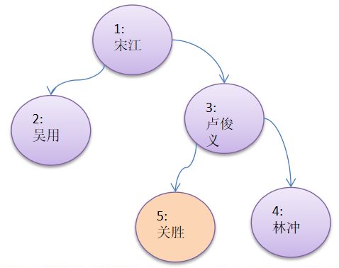

## 二叉树-删除节点
要求
- 如果删除的节点是叶子节点，则删除该节点
- 如果删除的节点是非叶子节点，则删除该子树.
- 测试，删除掉 5号叶子节点 和 3号子树.

完成删除节点的操作

思路

- 首先先处理:
考虑如果数是空数root,如果只有一个root节点,则等价将二叉树置空

- 然后进行下面的操作

1. 因为我们的二叉树是单向的,所以我们判断当前节点的子节点是否需要删除节点,而不能去判断当前这个节点是不是需要删除节点.
2. 如果当前节点的左子树不为空,并且左子节点no就是要删除结点,就将this.left=null; 并且就返回(结束递归删除)
3. 如果当前节点的右子树不为空,并且右子节点no就是要删除结点,就将this.right=null;并且就返回(结束递归删除)
4. 如果我们第二步和第三部都没有删除节点,那么我们就需要向左子树进行递归删除
5. 如果第四部也没有删除,则应当向右子树进行递归删除
6. 考虑如果数是空数 root,如果只有一个root节点,则等价于将二叉树置空

    
