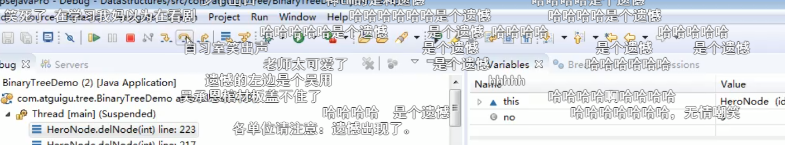
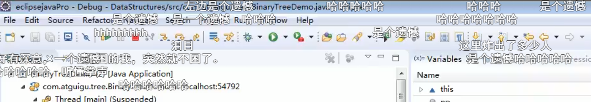
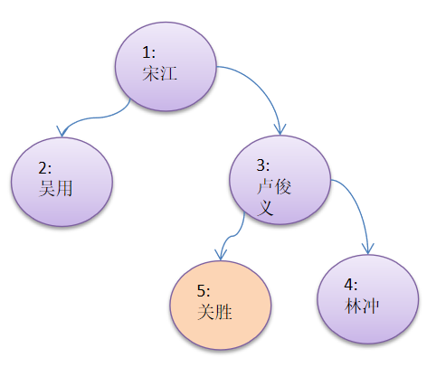

```java
/**
 *    // 删除节点 
 * @param no 编号
 */
public void delNode(int no) {
    if (root != null) {
        // 如果只有一个root 节点
        // 这里立即判断root 是不是就要删除的结点
        if (root.getNo() == no) {
            root = null;
        } else {
            // 递归删除
            root.delNode(no);
        }
    } else {
        System.out.println("空数 ,不能删除~~~");
    }
}
```

```java

/**
 * // 递归删除节点
 * // - 如果删除的节点是叶子节点，则删除该节点
 * //- 如果删除的节点是非叶子节点，则删除该子树.
 *
 * @param no
 */
public void delNode(int no) {
    /*
    *
    1. 因为我们的二叉树是单向的,所以我们判断当前节点的子节点是否需要删除节点,而不能去判断当前这个节点是不是需要删除节点.
    3. 如果当前节点的右子树不为空,并且右子节点no就是要删除结点,就将this.right=null;并且就返回(结束递归删除)
    4. 如果我们第二步和第三部都没有删除节点,那么我们就需要向左子树进行递归删除
    5. 如果第四部也没有删除,则应当向右子树进行递归删除
    * */

//         2. 如果当前节点的左子树不为空,并且左子节点no就是要删除结点,就将this.left=null; 并且就返回(结束递归删除)
    if (this.left != null && this.left.no == no) {
        this.left = null;
        return;
    }
//       3. 如果当前节点的右子树不为空,并且右子节点no就是要删除结点,就将this.right=null;并且就返回(结束递归删除)
    if (this.right != null && this.right.no == no) {
        this.right = null;
        return;
    }
//         4. 如果我们第二步和第三部都没有删除节点,那么我们就需要向左子树进行递归删除
    if (this.left != null) {
        this.left.delNode(no);
    }
//        5. 如果第四部也没有删除,则应当向右子树进行递归删除
    if (this.right != null) {
        this.right.delNode(no);
    }
}

```


测试

```java
// 测试一把删除节点
System.out.println("\n删除钱,前序遍历");
binaryTree.preOrder();
// 执行删除
binaryTree.delNode(5);
System.out.println("\n删除后,前序遍历");
binaryTree.preOrder();
```


```shell
删除钱,前序遍历
HeroNode{no=1, name='松江'}
HeroNode{no=2, name='吴用'}
HeroNode{no=3, name='卢俊义'}
HeroNode{no=5, name='关胜'}
HeroNode{no=4, name='林冲'}

删除后,前序遍历
HeroNode{no=1, name='松江'}
HeroNode{no=2, name='吴用'}
HeroNode{no=3, name='卢俊义'}
HeroNode{no=4, name='林冲'}

Process finished with exit code 0
```


完整代码


```java
package com.atguigu.tree;


/**
 * @author victor
 * @site https://victorfengming.gitee.io/
 * @project data_algorithm
 * @package com.atguigu.tree
 * @created 2021-02-24 21:40
 */
public class BinaryTreeDemo {
    public static void main(String[] args) {
        // 先需要创建一颗二叉树
        BinaryTree binaryTree = new BinaryTree();
        // 创建需要的节点
        HeroNode root = new HeroNode(1, "松江");
        HeroNode node2 = new HeroNode(2, "吴用");
        HeroNode node3 = new HeroNode(3, "卢俊义");
        HeroNode node4 = new HeroNode(4, "林冲");
        HeroNode node5 = new HeroNode(5, "关胜");
        // 说明: 这里我们先手动创建的二叉树
        // ,后面我们学习递归的方式创建二叉树
        root.setLeft(node2);
        root.setRight(node3);
        node3.setRight(node4);
        node3.setLeft(node5);
        binaryTree.setRoot(root);
        // 目前就挂载好了,二叉树的关系
        // 测试
//        System.out.println("前序遍历");//1,2,3,5,4
//        binaryTree.preOrder();
//        System.out.println("中序遍历");//2,1,5.3.4
//        binaryTree.infixOrder();
//        System.out.println("后序遍历");//2,5,4,3,1
//        binaryTree.postOrder();

        // 前序查找
        System.out.println("前序查找~~~");
        HeroNode resNode = binaryTree.preOrderSearch(2);
        if (resNode != null) {
            System.out.printf("找到了,信息为no=%d name=%s", resNode.getNo(), resNode.getName());
        } else {
            System.out.println("没有找到该英雄");
        }
        /*
         * 前序查找~~~
         * */

        // 中序遍历
        System.out.println("中序查找~~~");
        HeroNode resNode2 = binaryTree.infixOrderSearch(2);
        if (resNode2 != null) {
            System.out.printf("找到了,信息为no=%d name=%s", resNode2.getNo(), resNode2.getName());
        } else {
            System.out.println("没有找到该英雄");
        }
        /*
        中序查找~~~
        * */
        System.out.println("后序查找~~~");
        HeroNode resNode3 = binaryTree.infixOrderSearch(2);
        if (resNode3 != null) {
            System.out.printf("找到了,信息为no=%d name=%s", resNode3.getNo(), resNode3.getName());
        } else {
            System.out.println("没有找到该英雄");
        }

        // 测试一把删除节点
        System.out.println("\n删除钱,前序遍历");
        binaryTree.preOrder();
        // 执行删除
        binaryTree.delNode(5);
        System.out.println("\n删除后,前序遍历");
        binaryTree.preOrder();
    }
}

// 定义一个 BinaryTree
class BinaryTree {
    private HeroNode root;

    public void setRoot(HeroNode root) {
        this.root = root;
    }


    /**
     * // 删除节点
     *
     * @param no 编号
     */
    public void delNode(int no) {
        if (root != null) {
            // 如果只有一个root 节点
            // 这里立即判断root 是不是就要删除的结点
            if (root.getNo() == no) {
                root = null;
            } else {
                // 递归删除
                root.delNode(no);
            }
        } else {
            System.out.println("空数 ,不能删除~~~");
        }
    }

    // 真正的遍历操作
    // 前序遍历
    public void preOrder() {
        if (this.root != null) {
            this.root.preOrder();
        } else {
            System.out.println("当前二叉树为空,无法遍历!");
        }
    }

    // 中序遍历
    public void infixOrder() {
        if (this.root != null) {
            this.root.infixOrder();
        } else {
            System.out.println("二叉树为空,无法遍历");
        }
    }

    // 后续遍历
    public void postOrder() {
        if (this.root != null) {
            this.root.postOrder();
        } else {
            System.out.println("二叉树为空,无法遍历");

        }
    }


    /**
     * 前序查找
     *
     * @param no
     * @return
     */
    public HeroNode preOrderSearch(int no) {
        System.out.println("前序查找次数+1");
        if (root != null) {
            return root.preOrderSearch(no);
        } else {
            return null;
        }
    }

    /**
     * 中序查找
     *
     * @param no
     * @return
     */
    public HeroNode infixOrderSearch(int no) {
        if (root != null) {
            return root.infixOrderSearch(no);
        } else {
            return null;
        }
    }

    /**
     * 后序查找
     *
     * @param no
     * @return
     */
    public HeroNode postOrderSearch(int no) {
        if (root != null) {
            return root.postOrderSearch(no);

        } else {
            return null;
        }
    }
}

// 先创建 HeroNode 结点
class HeroNode {
    private int no;
    private String name;
    private HeroNode left;  // 默认为空
    private HeroNode right; // 默认为空

    public HeroNode(int no, String name) {
        this.no = no;
        this.name = name;
    }

    @Override
    public String toString() {
        return "HeroNode{" +
                "no=" + no +
                ", name='" + name + '\'' +
                '}';
    }

    public int getNo() {
        return no;
    }

    public void setNo(int no) {
        this.no = no;
    }

    public String getName() {
        return name;
    }

    public void setName(String name) {
        this.name = name;
    }

    public HeroNode getLeft() {
        return left;
    }

    public void setLeft(HeroNode left) {
        this.left = left;
    }

    public HeroNode getRight() {
        return right;
    }

    public void setRight(HeroNode right) {
        this.right = right;
    }


    /**
     * // 递归删除节点
     * // - 如果删除的节点是叶子节点，则删除该节点
     * //- 如果删除的节点是非叶子节点，则删除该子树.
     *
     * @param no
     */
    public void delNode(int no) {
        /*
        *
        1. 因为我们的二叉树是单向的,所以我们判断当前节点的子节点是否需要删除节点,而不能去判断当前这个节点是不是需要删除节点.
        3. 如果当前节点的右子树不为空,并且右子节点no就是要删除结点,就将this.right=null;并且就返回(结束递归删除)
        4. 如果我们第二步和第三部都没有删除节点,那么我们就需要向左子树进行递归删除
        5. 如果第四部也没有删除,则应当向右子树进行递归删除
        * */

//         2. 如果当前节点的左子树不为空,并且左子节点no就是要删除结点,就将this.left=null; 并且就返回(结束递归删除)
        if (this.left != null && this.left.no == no) {
            this.left = null;
            return;
        }
//       3. 如果当前节点的右子树不为空,并且右子节点no就是要删除结点,就将this.right=null;并且就返回(结束递归删除)
        if (this.right != null && this.right.no == no) {
            this.right = null;
            return;
        }
//         4. 如果我们第二步和第三部都没有删除节点,那么我们就需要向左子树进行递归删除
        if (this.left != null) {
            this.left.delNode(no);
        }
//        5. 如果第四部也没有删除,则应当向右子树进行递归删除
        if (this.right != null) {
            this.right.delNode(no);
        }
    }

    // 编写前序遍历的方法
    public void preOrder() {
        //
        System.out.println(this);
        // 先输出父节点
        // 递归向左子树前序比遍历
        if (this.left != null) {
            // 左边递归
            this.left.preOrder();
        }
        // 递归向右子树前序遍历
        if (this.right != null) {
            this.right.preOrder();
        }

    }

    // 中序遍历
    public void infixOrder() {
        // 递归向左子树中序遍历
        if (this.left != null) {
            this.left.infixOrder();
        }
        // 输出父节点
        System.out.println(this);
        // 递归向右子树遍历
        if (this.right != null) {
            this.right.infixOrder();
        }
    }

    // 后续遍历
    public void postOrder() {
        if (this.left != null) {
            this.left.postOrder();
        }
        if (this.right != null) {
            this.right.postOrder();
        }
        System.out.println(this);
    }


    /**
     * 前序查找
     *
     * @param no 查找no
     * @return 如果找到返回节点, 没有找到返回null
     */
    public HeroNode preOrderSearch(int no) {
        System.out.println("前序查找次数+1");
        // 比较当前节点是不是
        if (this.no == no) {
            return this;
        }
        // 1. 则判断当前节点的左子节点是否为空,如果不为空,则递归前序查找
        // 2. 如果左递归前序查找,找到节点,则返回
        HeroNode resNode = null;
        if (this.left != null) {
            resNode = this.left.preOrderSearch(no);
        }
        if (resNode != null) {
            return resNode;
        }
        // 1. 左递归前序查找,找到节点,则返回,否则继续判断
        // 2. 当前的节点的右子节点是否为空,如果不空,则继续向右递归前序查找
        if (this.right != null) {
            resNode = this.right.preOrderSearch(no);
        }
        return resNode;
    }

    /**
     * 中序查找
     *
     * @param no
     * @return
     */
    public HeroNode infixOrderSearch(int no) {
        // 判断当前节点的左子节点是否为空
        HeroNode resNode = null;
        if (this.left != null) {
            resNode = this.left.infixOrderSearch(no);
        }
        if (resNode != null) {
            return resNode;
        }
        System.out.println("中序查找次数+1");
        // 如果找到则返回,如果没有找到,就和当前节点比较,如果是则返回当前节点
        if (this.no == no) {
            return this;
        }
        // 否则继续记性右递归的中序查找
        if (this.right != null) {
            resNode = this.right.infixOrderSearch(no);
        }
        return resNode;
    }

    /**
     * 后续查找
     *
     * @param no 序号
     * @return 查找到了返回 那啥 ,否则返回null
     */
    public HeroNode postOrderSearch(int no) {
        // 先判断当前节点的左子节点是否为空,如果不为空,
        // 则递归后需查找
        HeroNode resNode = null;
        if (this.left != null) {
            resNode = this.left.postOrderSearch(no);
        }
        if (resNode != null) {
            return resNode;
        }
        // 如果左子树没有找到,则向右子树递归进行后序变量查找
        if (this.right != null) {
            resNode = this.right.postOrderSearch(no);
        }
        if (resNode != null) {
            return resNode;
        }
        System.out.println("后序查找次数+1");
        // 如果 左右子树 都没有找到,就比较当前节点是不是
        if (this.no == no) {
            return this;
        }
        return resNode;
    }
}


```

>找到吴用后,看下面的左右子节点
>
>但是很遗憾,吴用的左边是个遗憾





## 二叉树-删除节点
思考题(课后练习)
1. 如果要删除的节点是非叶子节点，现在我们不希望将该非叶子节点为根节点的子树删除，需要指定规则, 假如规定如下:
1. 如果该非叶子节点A只有一个子节点B，则子节点B替代节点A
1. 如果该非叶子节点A有左子节点B和右子节点C，则让左子节点B替代节点A。
1. 请大家思考，如何完成该删除功能, 老师给出提示.(课后练习)
1. 后面在讲解 二叉排序树时，在给大家讲解具体的删除方法




