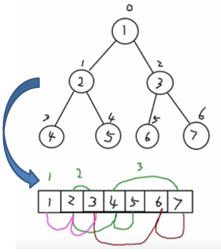
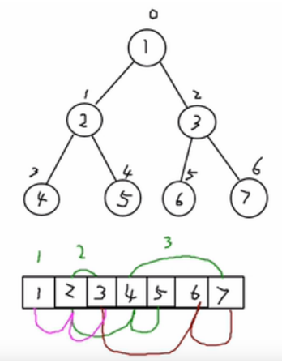

# 顺序存储二叉树
## 顺序存储二叉树的概念

- 基本说明
从数据存储来看，数组存储方式和树
的存储方式可以相互转换，即数组可
以转换成树，树也可以转换成数组，
看右面的示意图。


要求:
1. 右图的二叉树的结点，要求以数组的方式来存放 arr : [1, 2, 3, 4, 5, 6, 6]
1. 要求在遍历数组 arr时，仍然可以以前序遍历，中序遍历和后序遍历的方式完成结点的遍历



> 存放好数组后,要求还能体现出这个数的前序中序和后序的遍历
>
>

## 顺序存储二叉树的概念


## 顺序存储二叉树的特点:

1. 顺序二叉树通常只考虑[完全二叉树](091_二叉树_二叉树的概念和常用术语.md)
1. 第n个元素的左子节点为  2 * n + 1 
1. 第n个元素的右子节点为  2 * n + 2
1. 第n个元素的父节点为  (n-1) / 2
1. n : 表示二叉树中的第几个元素(按0开始编号如图所示)





顺序存储二叉树遍历

需求: 给你一个数组 {1,2,3,4,5,6,7}，要求以二叉树前序遍历的方式进行遍历。 前序遍历的结果应当为 1,2,4,5,3,6,7


课后练习：请同学们完成对数组以二叉树中序，后序遍历方式的代码.

```java
class ArrayBinaryTree {

private int[] arr;
public ArrayBinaryTree(int[] arr) {
this.arr = arr;}

public void preOrder() {
this.preOrder(0);}

public void preOrder(int index) {
if (arr == null || arr.length == 0) {
System.out.println("数组为空，不能按照二叉树前序遍历");
}
System.out.println(arr[index]);
if ((index * 2 + 1) < arr.length) {
preOrder(index * 2 + 1);
}
if ((index * 2 + 2) < arr.length) {
preOrder(index * 2 + 2);
}}}

```


顺序存储二叉树应用实例

八大排序算法中的堆排序，就会使用到顺序存储二叉树， 关于堆排序，我们放在<<树结构实际应用>> 章节讲解。


先看一个问题

将数列 {1, 3, 6, 8, 10, 14  } 构建成一颗二叉树.  n+1=7


问题分析: 
1. 当我们对上面的二叉树进行中序遍历时，数列为 {8, 3, 10, 1, 6, 14 }
1. 但是 6, 8, 10, 14 这几个节点的 左右指针，并没有完全的利用上.
1. 如果我们希望充分的利用 各个节点的左右指针， 让各个节点可以指向自己的前后节点,怎么办?
1. 解决方案-线索二叉树


