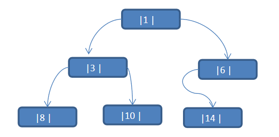

## 线索二叉树基本介绍

1. n个结点的二叉链表中含有n+1  【公式 2n-(n-1)=n+1】 个空指针域。利用二叉链表中的空指针域，存放指向该结点在某种遍历次序下的前驱和后继结点的指针（这种附加的指针称为"线索"）

1. 这种加上了线索的二叉链表称为线索链表，相应的二叉树称为线索二叉树(Threaded BinaryTree)。根据线索性质的不同，线索二叉树可分为前序线索二叉树、中序线索二叉树和后序线索二叉树三种

1. 一个结点的前一个结点，称为前驱结点
1. 一个结点的后一个结点，称为后继结点

## 线索二叉树应用案例

应用案例说明：将下面的二叉树，进行中序线索二叉树。中序遍历的数列为 {8, 3, 10, 1, 14, 6}

