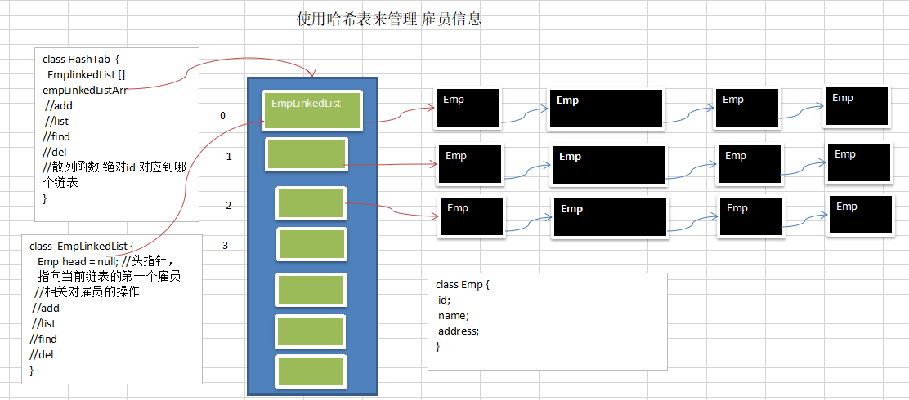

# 哈希表(散列)-Google上机题

看一个实际需求，google公司的一个上机题: 

有一个公司,当有新的员工来报道时,要求将该员工的信息加入(id,性别,年龄,住址..),当输入该员工的id时,要求查找到该员工的 所有信息.

要求: 不使用数据库,尽量节省内存,速度越快越好=>哈希表(散列)

散列表（Hash table，也叫哈希表），是根据关键码值(Key value)而直接进行访问的数据结构。也就是说，它通过把关键码值映射到表中一个位置来访问记录，以加快查找的速度。这个映射函数叫做散列函数，存放记录的数组叫做散列表。
15   111 % 15

> 哈希表就是数组里面存储链表
>
>

