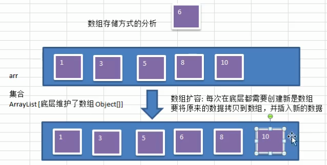
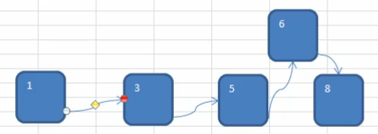
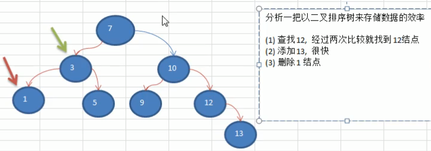

# 二叉树


## 数组的扩容


 
 
```java
package com.atguigu.tree;

import java.util.ArrayList;

/**
 * ClassName:  <br/>
 * Description:  <br/>
 * Date: 2021-02-24 14:21 <br/>
 * @project data_algorithm
 * @package com.atguigu.tree
 */
public class Test {
    public static void main(String[] args) {
        // ArrayList 底层维护了一个数组
        //        transient

        //        当容量不够的时候,
        //        grow()方法
        //        它会按照一种策略来进行扩容
        /**
         * ArrayList 底层也是进行数组寇蓉
         */
        ArrayList arrayList = new ArrayList();
    }
}
```

 
 
### ArrayList 的底层操作机制源码分析
- 1) ArrayList 中维护了一个Object类型的数组elementData. [debug看源码]
- 2)当创建对象时， 如果使用的是无参构造器，则初始elementData容量为0 (jdk7 是10)
- 3)如果使 用的是指定容量capacity的构造器，则初始elementData容量为capacity.
- 4)当添加元素时: 先判断是否需要扩容，如果需要扩容，则调用grow方法，否则直接添加元素到合适位置
- 5)如果使用的是无参构造器，如果第一次添加，需要扩容的话，则扩容elementData为10，如果需要再次扩容的
话，则扩容elementData为1.5倍。
- 6)如果使用的是指定容量capacity的构造器，如果需要扩容，则直接扩容elementData为1.5倍。

 
## 为什么需要树这种数据结构

1. 数组存储方式的分析
    - 优点：通过下标方式访问元素，速度快。**对于有序数组**，还可使用二分查找提高检索速度。
    - 缺点：如果要检索具体某个值，或者插入值(按一定顺序)会整体移动，效率较低 [示意图]
1. 链式存储方式的分析
    - 优点：在一定程度上对数组存储方式有优化(比如：插入一个数值节点，只需要将插入节点，链接到链表中即可， 删除效率也很好)。
    - 缺点：在进行检索时，效率仍然较低，比如(检索某个值，需要从头节点开始遍历) [示意图]
1. **树**存储方式的分析
能提高数据**存储，读取**的效率,  比如利用**二叉排序树**(Binary Sort Tree)，既可以保证数据的检索速度，同时也可以保证数据的插入，删除，修改的速度。【示意图,后面详讲】
案例: `[7, 3, 10, 1, 5, 9, 12]`
 
 
  
 
 
 
> 链式存储的添加,删除
> 检索要从第一个节点,开始遍历 



> 数的结构为什么?既能查的快,又能改的快
>
分析如果以**二叉排序树**来存储数据,那么对数据的增删改查的效率都可以提高

[7,3,10,1,5,9,12]



 
 
 
 
 
 
 
 
 
 
 
 
 
 
 
 
 
 
 
 
 
 
