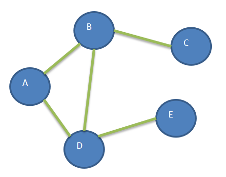
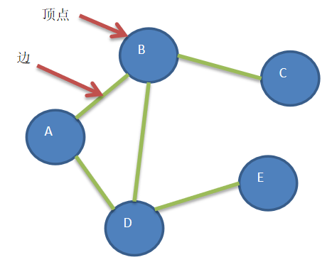
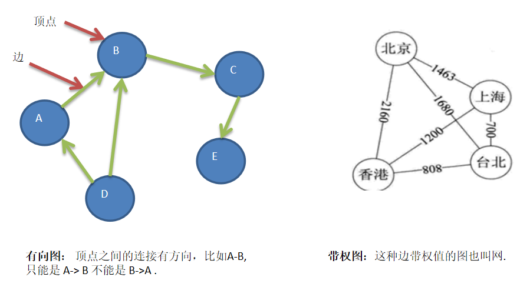
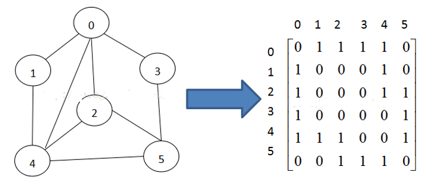
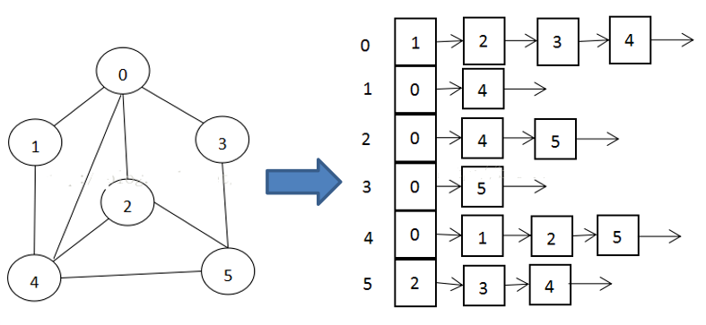
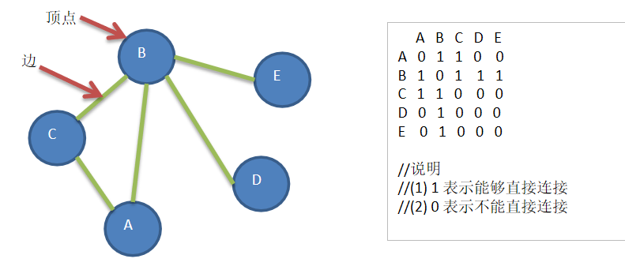

## 为什么要有图

- 前面我们学了线性表和树
- 线性表局限于一个直接前驱和一个直接后继的关系
- 树也只能有一个直接前驱也就是父节点
- 当我们需要表示多对多的关系时， 这里我们就用到了图


   
## 图的举例说明

图是一种数据结构，其中结点可以具有零个或多个相邻元素。两个结点之间的连接称为边。 结点也可以称为顶点。如图：





## 图的常用概念

- 顶点(vertex)
- 边(edge)
- 路径
- 无向图(右图)

- 无向图： 顶点之间的连接没有方向，比如A-B,
即可以是 A-> B 也可以 B->A .

```
路径:  比如从 D -> C 的路径有
1) D->B->C
2) D->A->B->C
```


   


- 有向图
- 带权图




图的表示方式有两种：二维数组表示（邻接矩阵）；链表表示（邻接表）。


## 邻接矩阵
邻接矩阵是表示图形中顶点之间相邻关系的矩阵，对于n个顶点的图而言，矩阵是的row和col表示的是1....n个点。





>能够直接连通的用1表示
>
>不能直接连通的就是0


## 邻接表
- 邻接矩阵需要为每个顶点都分配n个边的空间，其实有很多边都是不存在,会造成空间的一定损失.
- 邻接表的实现只关心存在的边，不关心不存在的边。因此没有空间浪费，邻接表由数组+链表组成




>箭头不表示连接
>
>只是一个大小顺序
>


### 说明:
- 标号为0的结点的相关联的结点为 1 2 3 4
- 标号为1的结点的相关联结点为0 4，
- 标号为2的结点相关联的结点为 0 4 5


要求: 

>代码实现如下图结构.





## 思路分析  
1. 存储顶点`String`  使用 `ArrayList`
1. 保存矩阵 `int[][] edges `
代码实现


