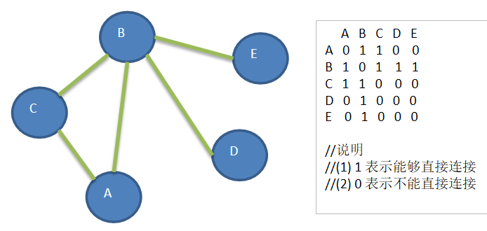
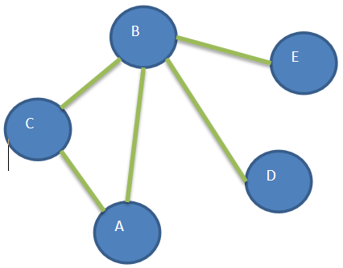

## 图遍历介绍
所谓图的遍历，即是对结点的访问。一个图有那么多个结点，如何遍历这些结点，需要特定策略，一般有两种访问策略: (1)深度优先遍历 (2)广度优先遍历
## 深度优先遍历基本思想

**图的深度优先搜索(Depth First Search) 。**
- 深度优先遍历，从初始访问结点出发，初始访问结点可能有多个邻接结点，深度优先遍历的策略就是首先访问第一个邻接结点，然后再以这个被访问的邻接结点作为初始结点，访问它的第一个邻接结点， 可以这样理解：每次都在访问完当前结点后首先访问当前结点的第一个邻接结点。
- 我们可以看到，这样的访问策略是优先往纵向挖掘深入，而不是对一个结点的所有邻接结点进行横向访问。
- 显然，深度优先搜索是一个递归的过程

## 深度优先遍历算法步骤
- 访问初始结点v，并标记结点v为已访问。
- 查找结点v的第一个邻接结点w。
- 若w存在，则继续执行4，如果w不存在，则回到第1步，将从v的下一个结点继续。
- 若w未被访问，对w进行深度优先遍历递归（即把w当做另一个v，然后进行步骤123）。
- 查找结点v的w邻接结点的下一个邻接结点，转到步骤3。

看一个具体案例分析:

   

1) 要求：

>对下图进行深度优先搜索, 从A 开始遍历.

 