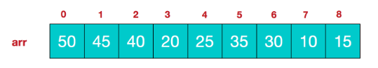

>数结构的实际应用
>
>

## 堆排序

### 堆排序基本介绍

1. 堆排序是利用**堆**这种数据结构而设计的一种排序算法,堆排序是一种选择排序,它的最坏,最好,平均时间复杂度均为O(nlogn),他也是不稳定排序.

2. 堆是具有以下性质的完全二叉树:每个节点的值都大于或等于其左右孩子结点的,称为大顶堆,注意:没有要求节点的左孩纸的值和右孩子的值的大小关系.
3. 每个节点的值都小于或等于其左右孩子节点的值,称为小顶堆
4. 大顶对举例说明

我们对堆中的结点按层进行编号，映射到数组中就是下面这个样子: 

大顶堆特点：arr[i] >= arr[2*i+1] && arr[i] >= arr[2*i+2]  // i 对应第几个节点，i从0开始编号

小顶堆举例说明

小顶堆：arr[i] <= arr[2*i+1] && arr[i] <= arr[2*i+2] // i 对应第几个节点，i从0开始编号
一般升序采用大顶堆，降序采用小顶堆 

