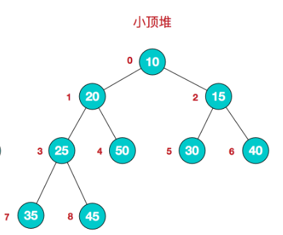

## 堆排序基本思想

1. 将待排序序列构造成一个大顶堆
1. 此时，整个序列的最大值就是堆顶的根节点。
1. 将其与末尾元素进行交换，此时末尾就为最大值。
1. 然后将剩余n-1个元素重新构造成一个堆，这样会得到n个元素的次小值。如此反复执行，便能得到一个有序序列了。

可以看到在构建大顶堆的过程中，元素的个数逐渐减少，最后就得到一个有序序列了.

>第一条 ,创建的是一个数组, 我们整个过程都没有树
>
>

步骤一 构造初始堆.将给定无序序列构造成一个大顶堆(一般升序采用大顶堆,降序采用小顶堆)

原始数组[4,6,8,5,9]

1. 假定给无序序列结构如下

2. 此时我们从最后一个非叶子节点开始(叶子节点自然不用调整,第一个非叶子结点 arr.length/2-1=5/2-1=1,也就是下面的6节点),从左至右,从下至上进行调整.

3. 找到第二个非叶子节点 4,由于[4,9,8]中 9元素最大,4和9交换

4. 这时,交换导致了子跟[4,5,6]结构混乱,继续调整,[4,5,6]中6最大,交换4,和6.

此时,我们就将一个无序序列构造成了一个大顶堆

**步骤2 将堆顶元素与末尾元素进行交换,使末尾元素最大.然后继续调整堆,在将堆顶元素与末尾元素交换,得到第二大元素.如此反复进行交换,重建,交换.**

1. 将堆顶元素9和末尾元素4记性交换

2. 重新调整结构,使其继续满足堆定义

3. 在将堆顶元素8与末尾元素5记性交换,得到第二大元素8

4. 后续过程,继续进行调整,交换,如此反复记性,最终使得整个序列有序

> 这里听不懂不要着急
>
>

# 在简单总结下堆排序的基本思路

1. 将无序序列构建成一个堆,根据升序降序需求选择大顶堆或者小顶堆;
1. 将堆顶元素与末尾元素交换,将最大元素"沉"到数组末端;
1. 重新调整结构,使其满足堆定义,然后继续交换堆顶元素与当前末尾元素,反复执行调整+交换步骤,直到这个整个序列有序.

