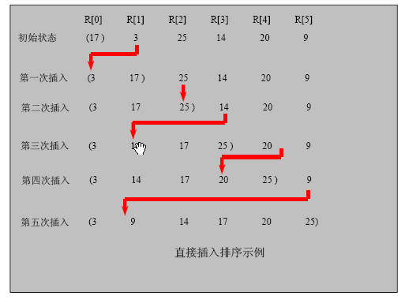

# 插入排序法
## 插入排序法思想:

插入排序（Insertion Sorting）的基本思想是：把n个待排序的元素看成为一个有序表和一个无序表，开始时有序表中只包含一个元素，无序表中包含有n-1个元素，排序过程中每次从无序表中取出第一个元素，把它的排序码依次与有序表元素的排序码进行比较，将它插入到有序表中的适当位置，使之成为新的有序表。
## 插入排序思路图:

## 插入排序法应用实例:

有一群小牛, 考试成绩分别是 101, 34, 119, 1  请从小到大排序

