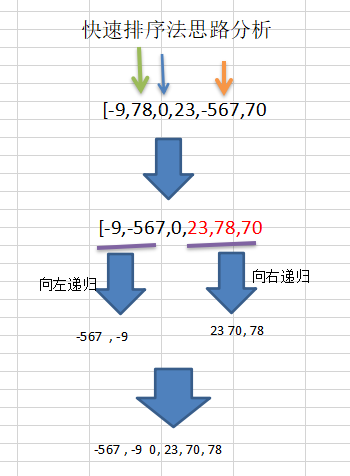

# 快速排序法
## 快速排序法介绍:

快速排序（Quicksort）是对冒泡排序的一种改进。基本思想是：通过一趟排序将要排序的数据分割成独立的两部分，其中一部分的所有数据都比另外一部分的所有数据都要小，然后再按此方法对这两部分数据分别进行快速排序，整个排序过程可以递归进行，以此达到整个数据变成有序序列

## 快速排序法示意图:

## 快速排序法应用实例:
要求: 对 [-9,78,0,23,-567,70] 进行从小到大的排序，

要求使用快速排序法。【测试8w和800w】 

### 说明[验证分析]:
- 如果取消左右递归，结果是  -9 -567 0 23 78 70
- 如果取消右递归,结果是  -567 -9 0 23 78 70
- 如果取消左递归,结果是  -9 -567 0 23 70 78

