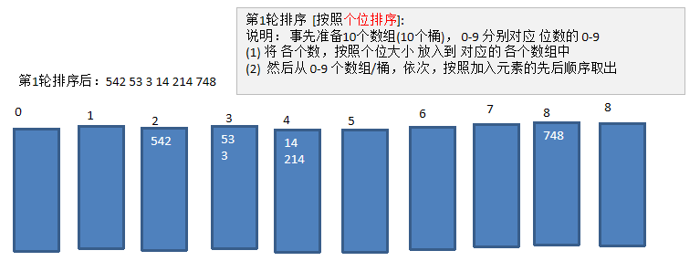
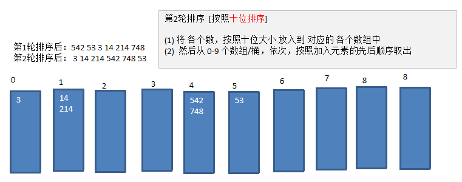
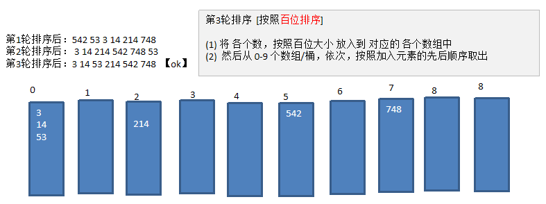

# 基数排序
## 基数排序(桶排序)介绍:

1. 基数排序（radix sort）属于“分配式排序”（distribution sort），又称“桶子法”（bucket sort）或bin sort，顾名思义，它是通过键值的各个位的值，将要排序的元素分配至某些“桶”中，达到排序的作用
1. 基数排序法是属于稳定性的排序，基数排序法的是效率高的**稳定性**排序法
1. 基数排序(Radix Sort)是桶排序的扩展
1. 基数排序是1887年赫尔曼·何乐礼发明的。它是这样实现的：将整数按位数切割成不同的数字，然后按每个位数分别比较。
## 基数排序基本思想

1. 将所有待比较数值统一为同样的数位长度，数位较短的数前面补零。然后，从最低位开始，依次进行一次排序。这样从最低位排序一直到最高位排序完成以后, 数列就变成一个有序序列。
1. 这样说明，比较难理解，下面我们看一个图文解释，理解基数排序的步骤

## 基数排序图文说明

将数组 `{53, 3, 542, 748, 14, 214} `使用基数排序, 进行升序排序。

第1轮排序后：542 53 3 14 214 748 

>第1轮排序  [按照个位排序]: 
>
>说明： 事先准备10个数组(10个桶)， 0-9 分别对应 位数的 0-9
>
>(1) 将 各个数，按照个位大小 放入到 对应的 各个数组中 
>
>(2)  然后从 0-9 个数组/桶，依次，按照加入元素的先后顺序取出  

>第2轮排序  [按照十位排序]
>
>(1) 将 各个数，按照十位大小 放入到 对应的 各个数组中 
>
>(2)  然后从 0-9 个数组/桶，依次，按照加入元素的先后顺序取出  
>

>第3轮排序  [按照百位排序]
>
>(1) 将 各个数，按照百位大小 放入到 对应的 各个数组中 
>
>(2)  然后从 0-9 个数组/桶，依次，按照加入元素的先后顺序取出  

> 当有相同的数据的时候,这个方法能够保证前面数的还是在前面
>
>技术排序是一个典型的空间换时间的方法
>
>这个基数排序 不适用与 这个 数据里面有负数的
>

