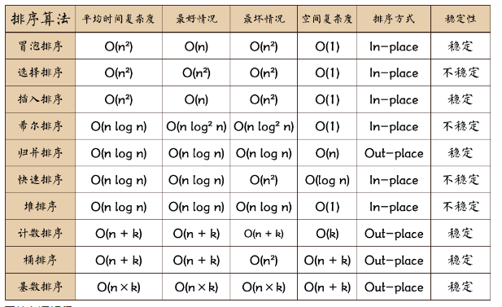

# 常用排序算法总结和对比

## 常用排序算法对比

## 相关术语解释：

1. 稳定：如果a原本在b前面，而`a=b`，排序之后a仍然在b的前面；
1. 不稳定：如果a原本在b的前面，而`a=b`，排序之后a可能会出现在b的后面；
1. 内排序：所有排序操作都在内存中完成；
1. 外排序：由于数据太大，因此把数据放在磁盘中，而排序通过磁盘和内存的数据传输才能进行；
1. 时间复杂度：一个算法执行所耗费的时间。
1. 空间复杂度：运行完一个程序所需内存的大小。
1. `n`: 数据规模
1. `k`: “桶”的个数
1. `In-place`:    不占用额外内存
1. `Out-place`: 占用额外内存

> 排序在算法中是很基础的算法,
>
>算法的学习 是不断进行的
>
>有空可以来看看这些算法

更多: [菜鸟排序](https://www.runoob.com/w3cnote_genre/algorithm)

