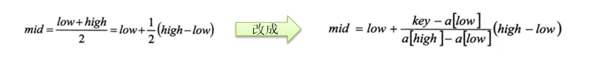

# 插值查找
## 插值查找算法

## 插值查找原理介绍:
	
1. 插值查找算法类似于二分查找，不同的是插值查找每次从**自适应mid**处开始查找。
1. 将折半查找中的求`mid` 索引的公式 , `low` 表示左边索引`left`, high表示右边索引right.key 就是前面我们讲的  `findVal`
    
1. `int mid = low + (high - low) * (key - arr[low]) / (arr[high] - arr[low]) ` ;/*插值索引*/
对应前面的代码公式：
`int mid = left + (right – left) * (findVal – arr[left]) / (arr[right] – arr[left])`
1. 举例说明插值查找算法 1-100 的数组

> 中间的参考,根据待查找的数字来定位 下标对应的 和 头尾的差值的比例
>

> 差值要求数据需要比较连续
>
>

