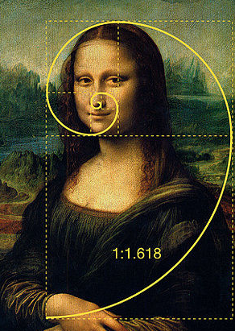

# 斐波那契查找

## 斐波那契(黄金分割法)查找算法

### 斐波那契(黄金分割法)查找基本介绍:
	
1. 黄金分割点是指把一条线段分割为两部分，使其中一部分与全长之比等于另一部分与这部分之比。取其前三位数字的近似值是0.618。由于按此比例设计的造型十分美丽，因此称为黄金分割，也称为中外比。这是一个神奇的数字，会带来意向不大的效果。
1. 斐波那契数列 {1, 1, 2, 3, 5, 8, 13, 21, 34, 55 } 发现斐波那契数列的两个相邻数 的比例，无限接近 黄金分割值0.618

 

 
 
### 斐波那契(黄金分割法)原理:
斐波那契查找原理与前两种相似，仅仅改变了中间结点（mid）的位置，mid不再是中间或插值得到，而是位于黄金分割点附近，即mid=low+F(k-1)-1（F代表斐波那契数列），如下图所示

