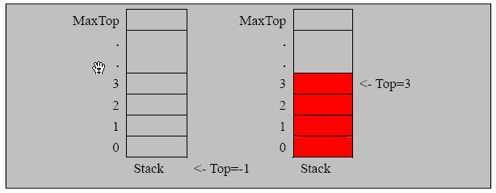

1. 用数组模拟栈的使用，由于栈是一种有序列表，当然可以使用数组的结构来储存栈的数据内容，下面我们就用数组模拟栈的出栈，入栈等操作。
1. 实现思路分析,并画出示意图
1. 对同学们加深栈的理解非常有帮助
1. 课堂练习，将老师写的程序改成使用链表来模拟栈.

### 实现 栈的 思路分析
1. 使用数组来模拟栈
2. 定义一个 `top`  来表示栈顶，初始化 为  `-1`
3. 入栈的操作，当有数据加入到栈时， `top++;  stack[top] = data;`
4. 出栈的操作， `int value = stack[top]; top--, return value`

