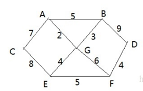
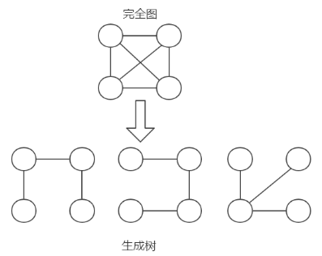

# 普里姆算法

## 应用场景-修路问题

看一个应用场景和问题：

## 最小生成树

修路问题本质就是就是最小生成树问题， 先介绍一下最小生成树(Minimum Cost Spanning Tree)，简称MST。
给定一个带权的无向连通图,如何选取一棵生成树,使树上所有边上权的总和为最小,这叫最小生成树 
N个顶点，一定有N-1条边
包含全部顶点
N-1条边都在图中
举例说明(如图:)
求最小生成树的算法主要是普里姆算法和克鲁斯卡尔算法

## 普里姆算法介绍

1. 普利姆(Prim)算法求最小生成树，也就是在包含n个顶点的连通图中，找出只有(n-1)条边包含所有n个顶点的连通子图，也就是所谓的极小连通子图
1. 普利姆的算法如下:
    1. 设G=(V,E)是连通网，T=(U,D)是最小生成树，V,U是顶点集合，E,D是边的集合 
    1. 若从顶点u开始构造最小生成树，则从集合V中取出顶点u放入集合U中，标记顶点v的visited[u]=1
    1. 若集合U中顶点ui与集合V-U中的顶点vj之间存在边，则寻找这些边中权值最小的边，但不能构成回路，将顶点vj加入集合U中，将边（ui,vj）加入集合D中，标记visited[vj]=1
    1. 重复步骤②，直到U与V相等，即所有顶点都被标记为访问过，此时D中有n-1条边
    1. 提示: 单独看步骤很难理解，我们通过代码来讲解，比较好理解.

有胜利乡有7个村庄(A, B, C, D, E, F, G) ，现在需要修路把7个村庄连通
各个村庄的距离用边线表示(权) ，比如 A – B 距离 5公里
问：如何修路保证各个村庄都能连通，并且总的修建公路总里程最短?
思路: 将10条边，连接即可，但是总的里程数不是最小.
正确的思路，就是尽可能的选择少的路线，并且每条路线最小，保证总里程数最少. 

