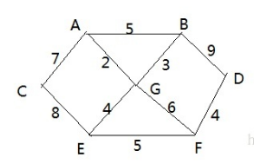

## 迪杰斯特拉(Dijkstra)算法介绍

迪杰斯特拉(Dijkstra)算法是典型最短路径算法，用于计算一个结点到其他结点的最短路径。 它的主要特点是以起始点为中心向外层层扩展(广度优先搜索思想)，直到扩展到终点为止。



## 迪杰斯特拉(Dijkstra)算法过程

>设置出发顶点为v，顶点集合V{v1,v2,vi...}，v到V中各顶点的距离构成距离集合Dis，Dis{d1,d2,di...}，Dis集合记录着v到图中各顶点的距离(到自身可以看作0，v到vi距离对应为di)
1. 从Dis中选择值最小的di并移出Dis集合，同时移出V集合中对应的顶点vi，此时的v到vi即为最短路径
1. 更新Dis集合，更新规则为：比较v到V集合中顶点的距离值，与v通过vi到V集合中顶点的距离值，保留值较小的一个(同时也应该更新顶点的前驱节点为vi，表明是通过vi到达的)
1. 重复执行两步骤，直到最短路径顶点为目标顶点即可结束

## 迪杰斯特拉(Dijkstra)算法最佳应用-最短路径

战争时期，胜利乡有7个村庄(A, B, C, D, E, F, G) ，现在有六个邮差，从G点出发，需要分别把邮件分别送到 A, B, C , D, E, F 六个村庄
各个村庄的距离用边线表示(权) ，比如 A – B 距离 5公里
问：如何计算出G村庄到 其它各个村庄的最短距离? 
如果从其它点出发到各个点的最短距离又是多少?

