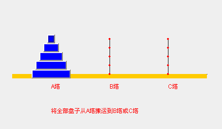

# 先看几个经典的算法面试题
## 字符串匹配问题::
- 1)有一个字符串str1=""硅硅谷尚硅谷你尚硅尚硅谷你尚硅谷你尚硅你好""，和一个子串str2="尚硅谷你尚硅你"
- 2)现在要判断str1是否含有str2,如果存在，就返回第一次出现的位置,如果没有，则返回-1
- 3)要求用最快的速度来完成选配
- 4)你的思路是什么?
    - ·暴力匹配
    - . KMP算法《部分匹配表》

 ## 先看几个经典的算法面试题
汉诺塔游戏, 请完成汉诺塔游戏的代码: 要求：1) 将A塔的所有圆盘移动到C塔。并且规定，在2) 小圆盘上不能放大圆盘，3)在三根柱子之间一次只能移动一个圆盘

