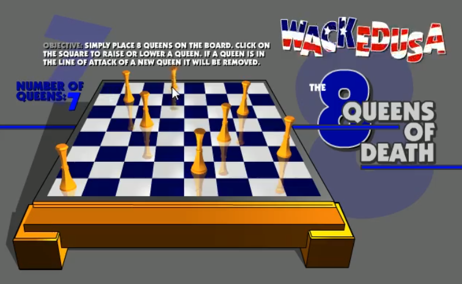

# 先看几个经典的算法面试题
## 八皇后问题
八皇后问题，是一个古老而著名的问题，是回溯算法的典型案例。该问题是国际西洋棋棋手马克斯·贝瑟尔于1848年提出：在8×8格的国际象棋上摆放八个皇后，使其不能互相攻击，即：任意两个皇后都不能处于同一行、同一列或同一斜线上，问有多少种摆法。【92】

###使用到回溯算法

高斯认为有76种方案。1854年在柏林的象棋杂志上不同的作者发表了40种不同的解，后来有人用图论的方法解出92种结果。计算机发明后，有多种计算机语言可以解决此问题

## 马踏棋盘算法
马踏棋盘算法介绍和游戏演示
马踏棋盘算法也被称为骑士周游问题
将马随机放在国际象棋的8×8棋盘`Board[0～7][0～7]`的某个方格中，马按走棋规则(马走日字)进行移动。要求每个方格只进入一次，走遍棋盘上全部64个方格
游戏演示: http://www.4399.com/flash/146267_2.htm 

会使用到图的深度优化遍历算法(DFS) + 贪心算法优化

### 马踏棋盘游戏代码实现

- 1)马踏棋盘问题(骑士周游问题)实际上是图的深度
优先搜索(DFS)的应用。
- 2)如果使用回溯(就是深度优先搜索)来解决，加
入马儿踏了53个点，如图:走到了第53个，坐标
(1,0) ，发现已经走到尽头，没办法，那就只能
回退了，查看其他的路径，就在棋盘上不停的回
.....效率很低，
- 3)因此需要使用贪心算法( greedyalgorithm)进行
优化。我们直接使用贪心算法优化思路来解决马
踏棋盘问题.
- 4)马踏棋盘问题思路分析+代码实现
- 5)使用前面的游戏来验证算法是否正确。

