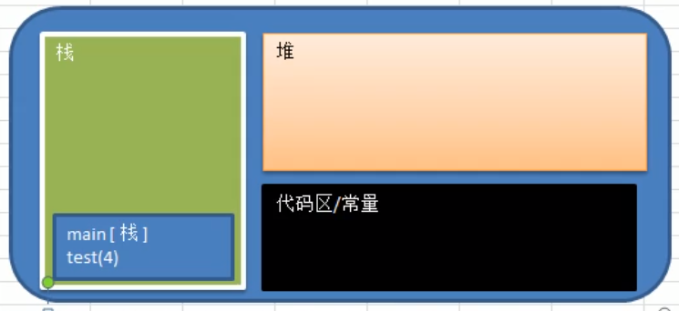
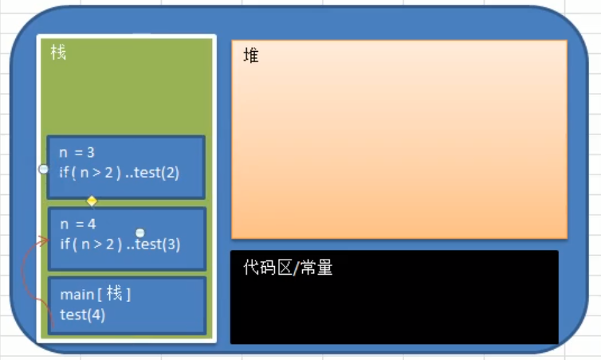
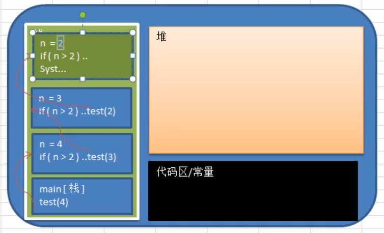
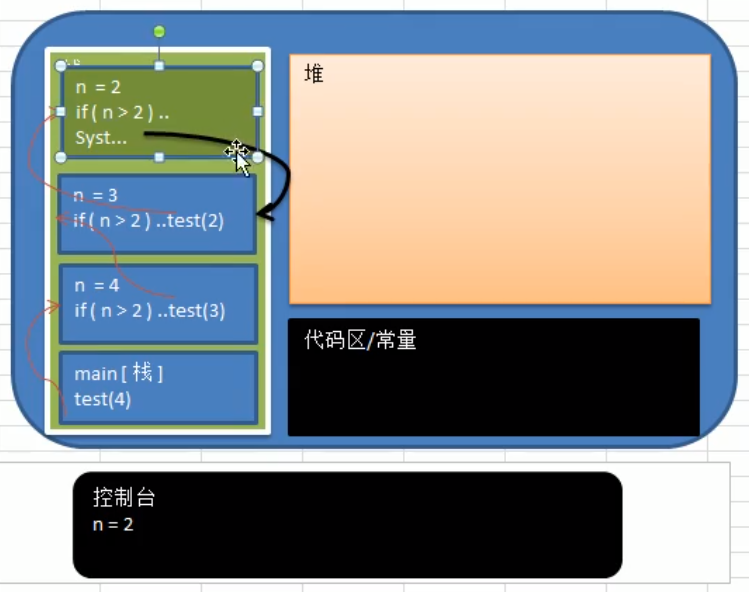
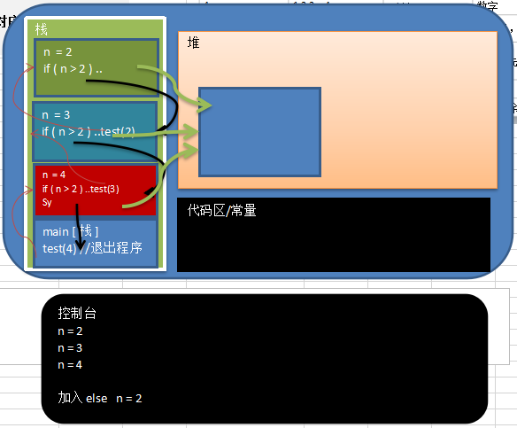

 # 递归
 ## 迷宫问题(回溯)
 
 
 ## 概念
 
 简单呐的说: 递归就是方法自己调用自己,每次调用时传入不同的变量,**递归有助于编程者解决复杂的问题**,同时让代码变得简洁.
 
 
 
 
 ## 案例-递归调用机制
 
### 打印问题
 
 
```java
public static void test(int n){
    if(n>2){
        test(n-1);
    }
    System.out.println("n="+n);
}
```
 


 
 
 
 
 递归调用规则:
 1. 当程序执行到一个方法时,就会开辟一个独立的空间(栈)
 
  
  
  
  

 
 
### 阶乘问题

 ```java
//阶乘问题
public static int factorial(int n) {
    if (n == 1) {
        return 1;
    } else {
        return factorial(n - 1) * n; // 1 * 2 * 3
    }
}
```
 
### 斐波那契数列

这个也是可以用这个 递归实现的

经典案例


 