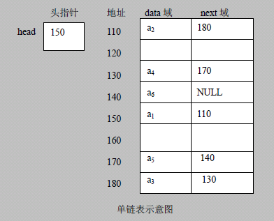

# 链表(Linked List)介绍

链表是有序的列表，但是它在内存中是存储如下

## 小结:
链表是以节点的方式来存储,是链式存储

每个节点包含 data 域， next 域：指向下一个节点.

如图：发现链表的各个节点不一定是连续存储.

链表分带头节点的链表和没有头节点的链表，根据实际的需求来确定

>结合一个实际的工作案例, 说明链表的实用价值

## 单链表

单链表(带头结点) 逻辑结构示意图如下

## 单链表的应用实例

使用带head头的单向链表实现 –水浒英雄排行榜管理
完成对英雄人物的增删改查操作， 注: 删除和修改,查找可以考虑学员独立完成，也可带学员完成
第一种方法在添加英雄时，直接添加到链表的尾部
第二种方式在添加英雄时，根据排名将英雄插入到指定位置(如果有这个排名，则添加失败，并给出提示)

## 单链表的常见面试题有如下:
求单链表中有效节点的个数

查找单链表中的倒数第k个结点 【新浪面试题】

单链表的反转【腾讯面试题，有点难度】

从尾到头打印单链表 【百度，要求方式1：反向遍历 。 方式2：Stack栈】

合并两个有序的单链表，合并之后的链表依然有序【课后练习.】

>直接看老师代码演示。

