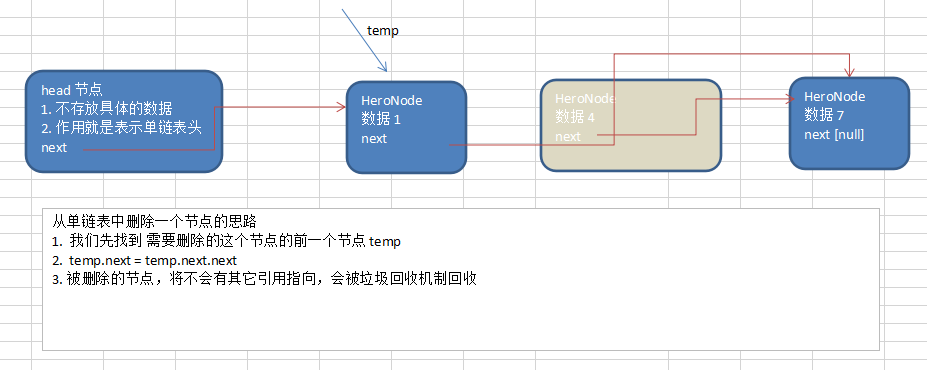

```java

	//删除节点
	//思路
	//1. head 不能动，因此我们需要一个temp辅助节点找到待删除节点的前一个节点
	//2. 说明我们在比较时，是temp.next.no 和  需要删除的节点的no比较
	public void del(int no) {
		HeroNode temp = head;
		boolean flag = false; // 标志是否找到待删除节点的
		while(true) {
			if(temp.next == null) { //已经到链表的最后
				break;
			}
			if(temp.next.no == no) {
				//找到的待删除节点的前一个节点temp
				flag = true;
				break;
			}
			temp = temp.next; //temp后移，遍历
		}
		//判断flag
		if(flag) { //找到
			//可以删除
			temp.next = temp.next.next;
		}else {
			System.out.printf("要删除的 %d 节点不存在\n", no);
		}
	}

```


