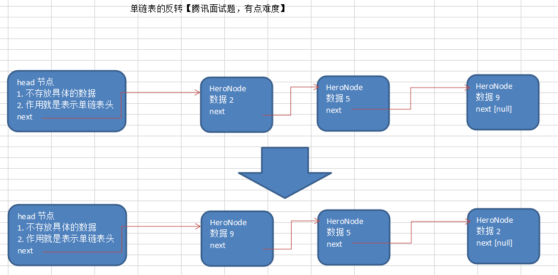
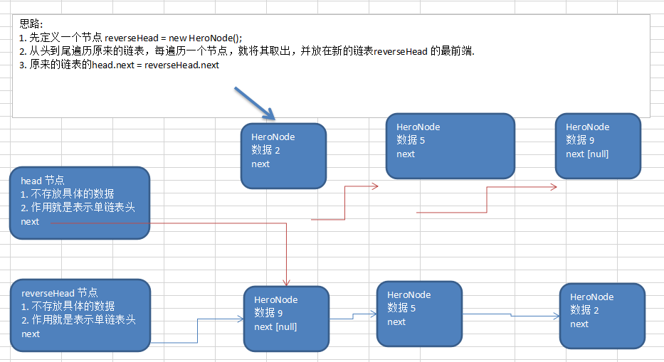

# 单链表的反转





```java

	//将单链表反转
	public static void reversetList(HeroNode head) {
		//如果当前链表为空，或者只有一个节点，无需反转，直接返回
		if(head.next == null || head.next.next == null) {
			return ;
		}

		//定义一个辅助的指针(变量)，帮助我们遍历原来的链表
		HeroNode cur = head.next;
		HeroNode next = null;// 指向当前节点[cur]的下一个节点
		HeroNode reverseHead = new HeroNode(0, "", "");
		//遍历原来的链表，每遍历一个节点，就将其取出，并放在新的链表reverseHead 的最前端
		//动脑筋
		while(cur != null) {
			next = cur.next;//先暂时保存当前节点的下一个节点，因为后面需要使用
			cur.next = reverseHead.next;//将cur的下一个节点指向新的链表的最前端
			reverseHead.next = cur; //将cur 连接到新的链表上
			cur = next;//让cur后移
		}
		//将head.next 指向 reverseHead.next , 实现单链表的反转
		head.next = reverseHead.next;
	}

```


```cmd
原来链表的情况~~
HeroNode [no=1, name=宋江, nickname=及时雨]
HeroNode [no=4, name=林冲, nickname=豹子头]
HeroNode [no=2, name=卢俊义, nickname=玉麒麟]
HeroNode [no=3, name=吴用, nickname=智多星]
反转单链表~~
HeroNode [no=3, name=吴用, nickname=智多星]
HeroNode [no=2, name=卢俊义, nickname=玉麒麟]
HeroNode [no=4, name=林冲, nickname=豹子头]
HeroNode [no=1, name=宋江, nickname=及时雨]

Process finished with exit code 0
```


