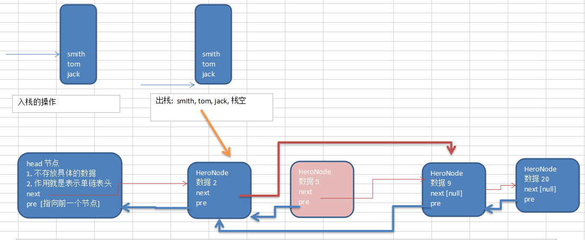

# 双向链表应用实例

使用带head头的双向链表实现 –水浒英雄排行榜

管理单向链表的缺点分析: 

单向链表，查找的方向只能是一个方向，而双向链表可以向前或者向后查找。

单向链表不能自我删除，需要靠辅助节点 ，而双向链表，则可以自我删除，所以前面我们单链表删除时节点，总是找到temp,temp是待删除节点的前一个节点(认真体会).

示意图帮助理解删除 

>课堂作业和思路提示:双向链表的第二种添加方式,按照编号顺序 [示意图]
按照单链表的顺序添加，稍作修改即可.

## 分析 双向链表的遍历，添加，修改，删除的操作思路 ===》代码实现
1) 遍历 方和 单链表一样，只是可以向前，也可以向后查找
2) 添加 (默认添加到双向链表的最后)
    - (1) 先找到双向链表的最后这个节点
    - (2) temp.next = newHeroNode
    - (3) newHeroNode.pre = temp;
3) 修改 思路和 原来的单向链表一样.
4) 删除
    - (1) 因为是双向链表，因此，我们可以实现自我删除某个节点
    - (2) 直接找到要删除的这个节点，比如temp
    - (3)  temp.pre.next = temp.next
    - (4) temp.next.pre = temp.pre;

