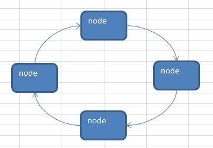
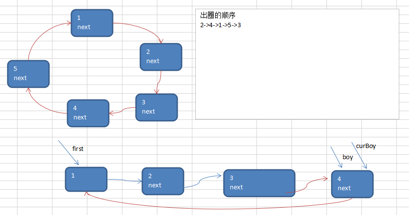

# 单向环形链表应用场景

## Josephu(约瑟夫、约瑟夫环)  问题
Josephu  问题为：设编号为1，2，… n的n个人围坐一圈，约定编号为k（1<=k<=n）的人从1开始报数，数到m 的那个人出列，它的下一位又从1开始报数，数到m的那个人又出列，依次类推，直到所有人出列为止，由此产生一个出队编号的序列。

## 提示：
用一个不带头结点的循环链表来处理Josephu 问题：先构成一个有n个结点的单循环链表，然后由k结点起从1开始计数，计到m时，对应结点从链表中删除，然后再从被删除结点的下一个结点又从1开始计数，直到最后一个结点从链表中删除算法结束。




`Josephu ` 问题为：设编号为`1，2，… n`的`n`个人围坐一圈，约定编号为`k（1<=k<=n）`的人从`1`开始报数，数到m 的那个人出列，它的下一位又从1开始报数，数到m的那个人又出列，依次类推，直到所有人出列为止，由此产生一个出队编号的序列。

```
n = 5 , 即有5个人 
k = 1, 从第一个人开始报数
m = 2, 数2下
```



**构建**一个单向的环形链表思路
1. 先创建第一个节点, 让 `first` 指向该节点，并形成环形
2. 后面当我们每创建一个新的节点，就把该节点，加入到已有的环形链表中即可.

遍历环形链表
1. 先让一个辅助指针(变量) `curBoy`，指向`first`节点
2. 然后通过一个`while`循环遍历 该环形链表即可 `curBoy.next  == first` 结束


