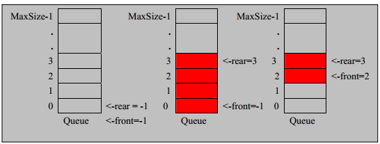

# 数组模拟队列

队列本身是有序列表，若使用数组的结构来存储队列的数据，则队列数组的声明如下图, 其中 `maxSize` 是该队列的最大容量。

因为队列的输出、输入是分别从前后端来处理，因此需要两个变量 `front`及 `rear`分别记录队列前后端的下标，`front` 会随着数据输出而改变，而 `rear`则是随着数据输入而改变，如图所示:




# 数组模拟队列

当我们将数据存入队列时称为”`addQueue`”，`addQueue` 的处理需要有两个步骤：思路分析 
将尾指针往后移：`rear+1` , 当`front == rear` 【空】
若尾指针 `rear` 小于队列的最大下标 `maxSize-1`，则将数据存入 `rear`所指的数组元素中，否则无法存入数据。 `rear  == maxSize - 1[队列满]`

代码实现
问题分析并优化


```java
class ArrayQueue(arrMaxSize: Int) { val maxSize: Int = arrMaxSize
  val array = new Array[Int](arrMaxSize)
  var front: Int = -1
  var rear: Int = -1
}

```

```java
 //初始化
 val queue = new ArrayQueue(3)
```

>`rear` 是队列最后[含]
>
>`front` 是队列最前元素[不含]
