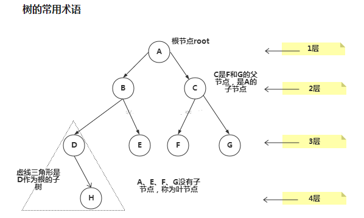
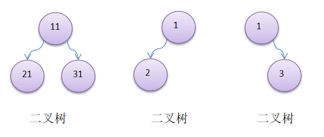
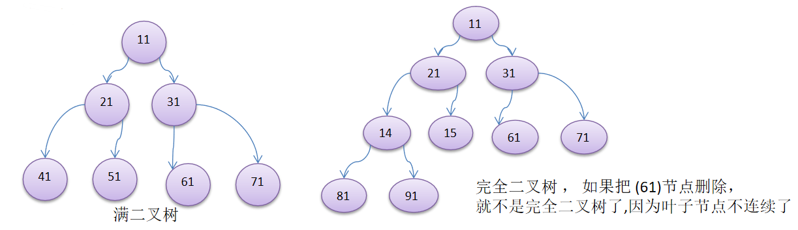

# 二叉树

## 树示意图

## 树的常用术语(结合示意图理解):
- 节点
- 根节点
- 父节点
- 子节点
- 叶子节点 (没有子节点的节点)
- 节点的权(节点值)
- 路径(从root节点找到该节点的路线)
- 层
- 子树
- 树的高度(最大层数)
- 森林 :多颗子树构成森林

## 二叉树的概念

1. 树有很多种，每个节点最多只能有两个子节点的一种形式称为二叉树。
1. 二叉树的子节点分为左节点和右节点。
二叉树的概念
1. 如果该二叉树的所有叶子节点都在最后一层，并且结点总数= 2^n -1 , n 为层数，则我们称为满二叉树。
1. 如果该二叉树的所有叶子节点都在最后一层或者倒数第二层，而且最后一层的叶子节点在左边连续，倒数第二层的叶子节点在右边连续，我们称为完全二叉树。

我们重点讲解一下二叉树的前序遍历，中序遍历和后序遍历。

> 满二叉树一定是完全二叉树,反之不一定 
