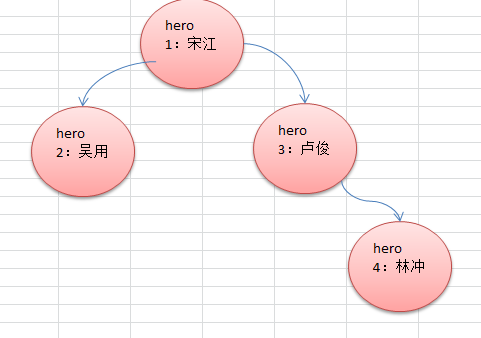

## 二叉树遍历的说明

使用前序，中序和后序对下面的二叉树进行遍历.





- 前序遍历: 先输出父节点，再遍历左子树和右子树
- 中序遍历: 先遍历左子树，再输出父节点，再遍历右子树
- 后序遍历: 先遍历左子树，再遍历右子树，最后输出父节点
小结: 看输出父节点的顺序，就确定是**前序，中序还是后序**


二叉树遍历应用实例(前序,中序,后序)

.


要求如下：
前上图的 3号节点 "卢俊"  , 增加一个左子节点 [5, 关胜]
使用前序，中序，后序遍历，请写出各自输出的顺序是什么?


```java
class HeroNode {
    private int no;
    private String name;
    private HeroNode leftNode;
    private HeroNode rightNode;
    public HeroNode(int hNo, String hName) {
    no = hNo;
    name = hName;
}
// 前序遍历
public void preOrder() {
    System.out.println(this);//先输出父节点
    if (this.leftNode != null) {
        this.leftNode.preOrder();
    }
    if (this.rightNode != null) {
        this.rightNode.preOrder();
    }
}

```

```java
class BinaryTree {
private HeroNode root;

public void setRoot(HeroNode root) {
    this.root = root;
}

// 前序遍历
public void preOrder() {
    if (root != null) {
        root.preOrder();
    }
}
}


```

