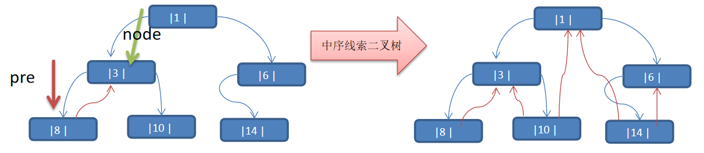

线索二叉树应用案例

思路分析:  中序遍历的结果：{8, 3, 10, 1, 14, 6}

说明: 当线索化二叉树后，Node节点的 属性 left 和 right ，有如下情况:
1. left 指向的是左子树，也可能是指向的前驱节点. 比如 ① 节点 left 指向的左子树, 而 ⑩ 节点的 left 指向的就是前驱节点.
1. right指向的是右子树，也可能是指向后继节点，比如 ① 节点right 指向的是右子树，而⑩ 节点的right 指向的是后继节点.

