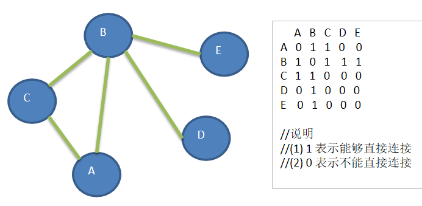

## 广度优先遍历基本思想
```
图的广度优先搜索(Broad First Search) 。
类似于一个分层搜索的过程，
广度优先遍历需要使用一个队列以保持访问过的结点的顺序
以便按这个顺序来访问这些结点的邻接结点
```
### 广度优先遍历算法步骤
1. 访问初始结点v并标记结点v为已访问。
1. 结点v入队列
1. 当队列非空时，继续执行，否则算法结束。
1. 出队列，取得队头结点u。
1. 查找结点u的第一个邻接结点w。
1. 若结点u的邻接结点w不存在，则转到步骤3；否则循环执行以下三个步骤：
    1. 若结点w尚未被访问，则访问结点w并标记为已访问。 
    1. 结点w入队列 
    1. 查找结点u的继w邻接结点后的下一个邻接结点w，转到步骤6。


广度优先举例说明





广度优先遍历

对一个节点进行广度优先遍历的方法

队列 头结点

队列存储走的路径,记录节点访问的顺序

一旦走到头了,就要往回走

