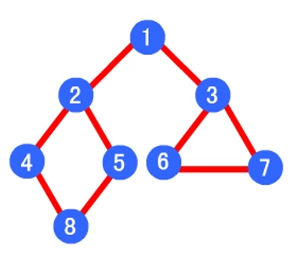

应用实例





```
graph.insertEdge(0, 1, 1);
graph.insertEdge(0, 2, 1);
graph.insertEdge(1, 3, 1);
graph.insertEdge(1, 4, 1);
graph.insertEdge(3, 7, 1);
graph.insertEdge(4, 7, 1);
graph.insertEdge(2, 5, 1);
graph.insertEdge(2, 6, 1);
graph.insertEdge(5, 6, 1);
```


- 深度优先遍历顺序为 1->2->4->8->5->3->6->7
- 广度优先算法的遍历顺序为：1->2->3->4->5->6->7->8 

