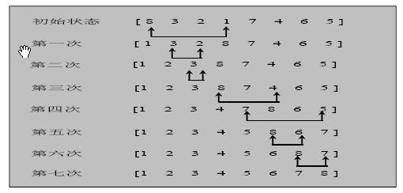

> 选择排序冒泡的反向思维
>
# 选择排序

## 基本介绍

选择式排序也属于内部排序法，是从欲排序的数据中，按指定的规则选出某一元素，再依规定交换位置后达到排序的目的。

## 选择排序思想:

选择排序（select sorting）也是一种简单的排序方法。它的基本思想是：第一次从arr[0]~arr[n-1]中选取最小值，与arr[0]交换，第二次从arr[1]~arr[n-1]中选取最小值，与arr[1]交换，第三次从arr[2]~arr[n-1]中选取最小值，与arr[2]交换，…，第i次从arr[i-1]~arr[n-1]中选取最小值，与arr[i-1]交换，…, 第n-1次从arr[n-2]~arr[n-1]中选取最小值，与arr[n-2]交换，总共通过n-1次，得到一个按排序码从小到大排列的有序序列。

## 选择排序思路分析

选择排序应用实例:

有一群牛 , 颜值分别是 101, 34, 119, 1 请使用选择排序从低到高进行排序 [101, 34, 119, 1]

说明: 测试效率的数据 80000，看耗时

