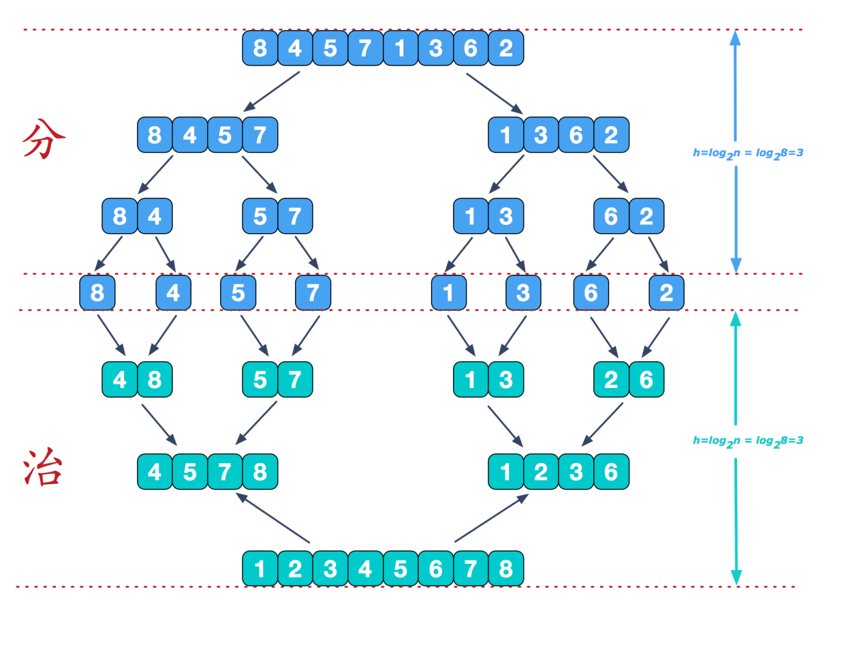
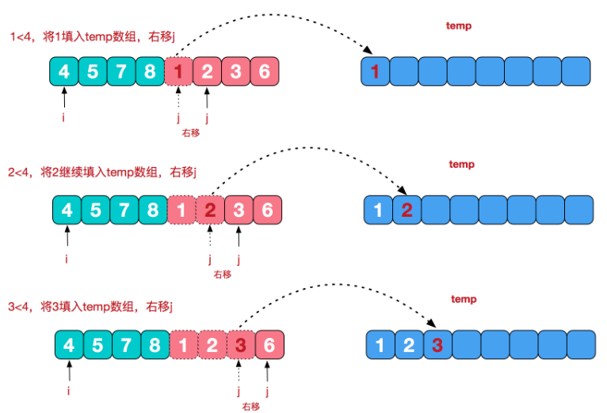

# 归并排序
## 归并排序介绍:

归并排序（MERGE-SORT）是利用归并的思想实现的排序方法，该算法采用经典的分治（divide-and-conquer）策略（分治法将问题分(divide)成一些小的问题然后递归求解，而治(conquer)的阶段则将分的阶段得到的各答案"修补"在一起，即分而治之)。

归并排序思想示意图1-基本思想:

## 说明:
可以看到这种结构很像一棵完全二叉树，本文的归并排序我们采用递归去实现（也可采用迭代的方式去实现）。分阶段可以理解为就是递归拆分子序列的过程。

## 归并排序思想示意图2-合并相邻有序子序列:
再来看看治阶段，我们需要将两个已经有序的子序列合并成一个有序序列，比如上图中的最后一次合并，要将[4,5,7,8]和[1,2,3,6]两个已经有序的子序列，合并为最终序列[1,2,3,4,5,6,7,8]，来看下实现步骤

## 归并排序的应用实例:
给你一个数组, val arr = Array(9,8,7,6,5,4,3,2,1), 请使用归并排序完成排序。

