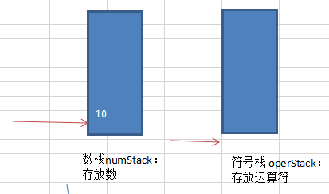

# 使用栈来完成一个表达式的结果
## 使用栈完成计算 一个表达式的结果 
```
7*2*2-5+1-5+3-4 = ？
3+2*6-2
```




## 使用栈完成表达式的计算 思路
1. 通过一个 index  值（索引），来遍历我们的表达式
2. 如果我们发现是一个数字, 就直接入数栈
3. 如果发现扫描到是一个符号,  就分如下情况
    - 3.1 如果发现当前的符号栈为 空，就直接入栈
    - 3.2 如果符号栈有操作符，就进行比较,**如果当前的操作符的优先级小于或者等于栈中的操作符** 就需要从数栈中pop出两个数,在从符号栈中pop出一个符号，进行运算，将得到结果，入数栈，然后将当前的操作符入符号栈， 如果当前的操作符的优先级大于栈中的操作符， 就直接入符号栈.
4. 当表达式扫描完毕，就顺序的从 数栈和符号栈中pop出相应的数和符号，并运行.
5. 最后在数栈只有一个数字，就是表达式的结果

>验证： 3+2*6-2 = 13 


