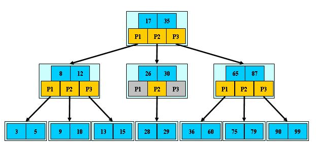
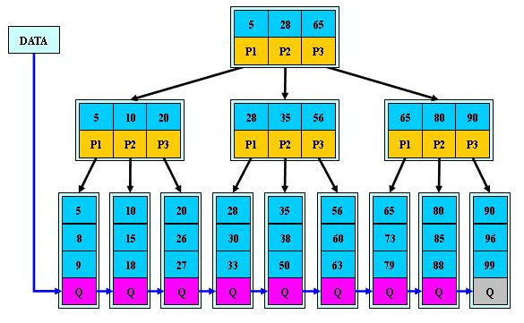
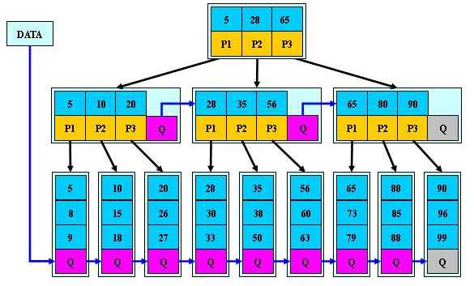

## B树的介绍

B-tree树即B树，B即Balanced，平衡的意思。有人把B-tree翻译成B-树，容易让人产生误解。会以为B-树是一种树，而B树又是另一种树。实际上，B-tree就是指的B树。

## B树的介绍
前面已经介绍了2-3树和2-3-4树，他们就是B树(英语：B-tree 也写成B-树)，这里我们再做一个说明，我们在学习Mysql时，经常听到说某种类型的索引是基于B树或者B+树的，如图:

## B树的说明:
- B树的阶：节点的最多子节点个数。比如2-3树的阶是3，2-3-4树的阶是4
- B-树的搜索，从根结点开始，对结点内的关键字（有序）序列进行二分查找，如果命中则结束，否则进入查询关键字所属范围的儿子结点；重复，直到所对应的儿子指针为空，或已经是叶子结点

- 关键字集合分布在整颗树中, 即叶子节点和非叶子节点都存放数据.
- 搜索有可能在非叶子结点结束
- 其搜索性能等价于在关键字全集内做一次二分查找

## B+树的介绍
B+树是B树的变体，也是一种多路搜索树。

## B+树的说明:
- B+树的搜索与B树也基本相同，区别是B+树只有达到叶子结点才命中（B树可以在非叶子结点命中），其性能也等价于在关键字全集做一次二分查找
- 所有关键字都出现在叶子结点的链表中（即数据只能在叶子节点【也叫稠密索引】），且链表中的关键字(数据)恰好是有序的。
- 不可能在非叶子结点命中
- 非叶子结点相当于是叶子结点的索引（稀疏索引），叶子结点相当于是存储（关键字）数据的数据层
- 更适合文件索引系统
- B树和B+树各有自己的应用场景，不能说B+树完全比B树好，反之亦然.

## B*树的介绍
B*树是B+树的变体，在B+树的非根和非叶子结点再增加指向兄弟的指针。

## B*树的说明:
- B*树定义了非叶子结点关键字个数至少为(2/3)*M，即块的最低使用率为2/3，而B+树的块的最低使用率为B+树的1/2。

- 从第1个特点我们可以看出，B*树分配新结点的概率比B+树要低，空间使用率更高

