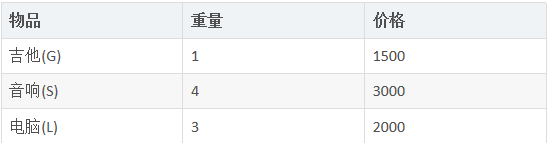

## 动态规划算法介绍

动态规划(Dynamic Programming)算法的核心思想是：将大问题划分为小问题进行解决，从而一步步获取最优解的处理算法

动态规划算法与分治算法类似，其基本思想也是将待求解问题分解成若干个子问题，先求解子问题，然后从这些子问题的解得到原问题的解。

与分治法不同的是，适合于用动态规划求解的问题，经分解得到子问题往往不是互相独立的。 ( 即下一个子阶段的求解是建立在上一个子阶段的解的基础上，进行进一步的求解 )

动态规划可以通过填表的方式来逐步推进，得到最优解.

## 动态规划算法最佳实践-背包问题

背包问题：有一个背包，容量为4磅 ， 现有如下物品

要求达到的目标为装入的背包的总价值最大，并且重量不超出
要求装入的物品不能重复

## 思路分析和图解

背包问题主要是指一个给定容量的背包、若干具有一定价值和重量的物品，如何选择物品放入背包使物品的价值最大。其中又分01背包和完全背包(完全背包指的是：每种物品都有无限件可用)
这里的问题属于01背包，即每个物品最多放一个。而无限背包可以转化为01背包。

 

动态规划算法最佳实践-背包问题
### 思路分析和图解
算法的主要思想，利用动态规划来解决。每次遍历到的第i个物品，根据w[i]和v[i]来确定是否需要将该物品放入背包中。即对于给定的n个物品，设v[i]、w[i]分别为第i个物品的价值和重量，C为背包的容量。再令v[i][j]表示在前i个物品中能够装入容量为j的背包中的最大价值。则我们有下面的结果：

(1)  v[i][0]=v[0][j]=0; //表示 填入表 第一行和第一列是0

(2) 当w[i]> j 时：v[i][j]=v[i-1][j]   // 当准备加入新增的商品的容量大于 当前背包的容量时，就直接使用上一个单元格的装入策略

(3) 当j>=w[i]时： v[i][j]=max{v[i-1][j], v[i]+v[i-1][j-w[i]]}  
// 当 准备加入的新增的商品的容量小于等于当前背包的容量,
// 装入的方式:
v[i-1][j]： 就是上一个单元格的装入的最大值
v[i] : 表示当前商品的价值 
v[i-1][j-w[i]] ： 装入i-1商品，到剩余空间j-w[i]的最大值
当j>=w[i]时： v[i][j]=max{v[i-1][j], v[i]+v[i-1][j-w[i]]} : 
