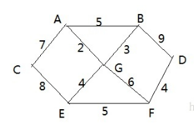

## 弗洛伊德(Floyd)算法介绍

和Dijkstra算法一样，弗洛伊德(Floyd)算法也是一种用于寻找给定的加权图中顶点间最短路径的算法。该算法名称以创始人之一、1978年图灵奖获得者、斯坦福大学计算机科学系教授罗伯特·弗洛伊德命名
弗洛伊德算法(Floyd)计算图中各个顶点之间的最短路径
迪杰斯特拉算法用于计算图中某一个顶点到其他顶点的最短路径。
弗洛伊德算法 VS 迪杰斯特拉算法：迪杰斯特拉算法通过选定的被访问顶点，求出从出发访问顶点到其他顶点的最短路径；弗洛伊德算法中每一个顶点都是出发访问点，所以需要将每一个顶点看做被访问顶点，求出从每一个顶点到其他顶点的最短路径。

## 弗洛伊德(Floyd)算法图解分析

1. 设置顶点vi到顶点vk的最短路径已知为Lik，顶点vk到vj的最短路径已知为Lkj，顶点vi到vj的路径为Lij，则vi到vj的最短路径为：min((Lik+Lkj),Lij)，vk的取值为图中所有顶点，则可获得vi到vj的最短路径
1. 至于vi到vk的最短路径Lik或者vk到vj的最短路径Lkj，是以同样的方式获得

1. 弗洛伊德(Floyd)算法图解分析-举例说明

弗洛伊德(Floyd)算法最佳应用-最短路径

1. 胜利乡有7个村庄(A, B, C, D, E, F, G)
1. 各个村庄的距离用边线表示(权) ，比如 A – B 距离 5公里
1. 问：如何计算出各村庄到 其它各村庄的最短距离? 

