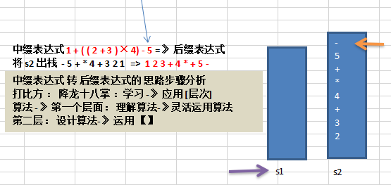

 
 
 
# 中缀表达式转换为后缀表达式

 
大家看到，后缀表达式适合计算式进行运算，但是人却不太容易写出来，尤其是表达式很长的情况下，因此在开发中，我们需要将 中缀表达式转成后缀表达式。

## 具体步骤如下:
1. 初始化两个栈：运算符栈s1和储存中间结果的栈s2；
1. 从左至右扫描中缀表达式；
1. 遇到操作数时，将其压s2；
1. 遇到运算符时，比较其与s1栈顶运算符的优先级：
    1. 如果s1为空，或栈顶运算符为左括号“(”，则直接将此运算符入栈；
    1. 否则，若优先级比栈顶运算符的高，也将运算符压入s1；
    1. 否则，将s1栈顶的运算符弹出并压入到s2中，再次转到(4-1)与s1中新的栈顶运算符相比较；	
1. 遇到括号时：(1) 如果是左括号“(”，则直接压入s1(2) 如果是右括号“)”，则依次弹出s1栈顶的运算符，并压入s2，直到遇到左括号为止，此时将这一对括号丢弃
1. 重复步骤2至5，直到表达式的最右边
1. 将s1中剩余的运算符依次弹出并压入s2
1. 依次弹出s2中的元素并输出，结果的逆序即为中缀表达式对应的后缀表达式

>
## 举例说明:
将中缀表达式“1+((2+3)×4)-5”转换为后缀表达式的过程如下

因此结果为 
`"1 2 3 + 4 × + 5 –"`

 
| 扫描到的元素 | s2(栈底->栈顶)        | s1 (栈底->栈顶) | 说明                               |
| ------------ | --------------------- | --------------- | ---------------------------------- |
| 1            | 1                     | 空              | 数字，直接入栈                     |
| +            | 1                     | +               | s1为空，运算符直接入栈             |
| (            | 1                     | + (             | 左括号，直接入栈                   |
| (            | 1                     | + ( (           | 同上                               |
| 2            | 1 2                   | + ( (           | 数字                               |
| +            | 1 2                   | + ( ( +         | s1栈顶为左括号，运算符直接入栈     |
| 3            | 1 2 3                 | + ( ( +         | 数字                               |
| )            | 1 2 3 +               | + (             | 右括号，弹出运算符直至遇到左括号   |
| ×            | 1 2 3 +               | + ( ×           | s1栈顶为左括号，运算符直接入栈     |
| 4            | 1 2 3 + 4             | + ( ×           | 数字                               |
| )            | 1 2 3 + 4 ×           | +               | 右括号，弹出运算符直至遇到左括号   |
| -            | 1 2 3 + 4 × +         | -               | -与+优先级相同，因此弹出+，再压入- |
| 5            | 1 2 3 + 4 × + 5       | -               | 数字                               |
| 到达最右端   | **1 2 3 + 4 × + 5 -** | 空              | s1中剩余的运算符                   |

> 至于这个是怎么想出来的,这个你得问那些秃头的大佬
>
>
>

