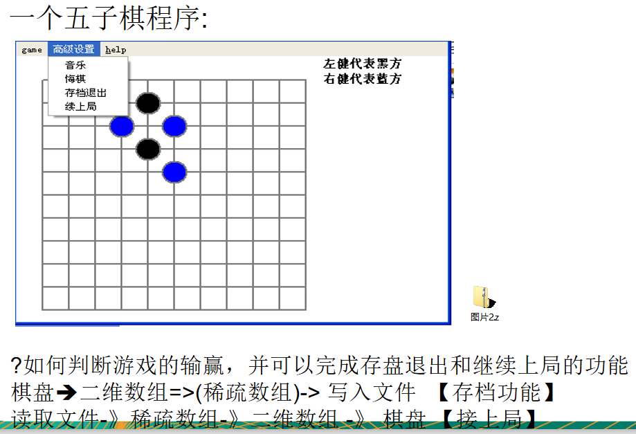

# 看几个实际编程中遇到的问题

```Java
	 public static void main(String[] args) {
		String str = "Java,Java, hello,world!";
		String newStr = str.replaceAll("Java", "尚硅谷~"); //算法
		System.out.println("newStr=" + newStr);
	}
```

问：试写出用单链表表示的字符串类及字符串结点类的定义，并依次实现它的构造函数、以及计算串长度、串赋值、判断两串相等、求子串、两串连接、求子串在串中位置等7个成员函数。 



## 约瑟夫(Josephu)问题(丢手帕问题)

Josephu  问题为：设编号为1，2，… n的n个人围坐一圈，约定编号为k（1<=k<=n）的人从1开始报数，数到m 的那个人出列，它的下一位又从1开始报数，数到m的那个人又出列，依次类推，直到所有人出列为止，由此产生一个出队编号的序列。

提示：用一个不带头结点的循环链表来处理Josephu 问题：先构成一个有n个结点的单循环链表（单向环形链表），然后由k结点起从1开始计数，计到m时，对应结点从链表中删除，然后再从被删除结点的下一个结点又从1开始计数，直到最后一个结点从链表中删除算法结束。


>修路问题  => 最小生成树(加权值)【数据结构】+ 普利姆算法
>
>最短路径问题  => 图+弗洛伊德算法
>
>汉诺塔 => 分支算法 
>
>八皇后问题 => 回溯法


