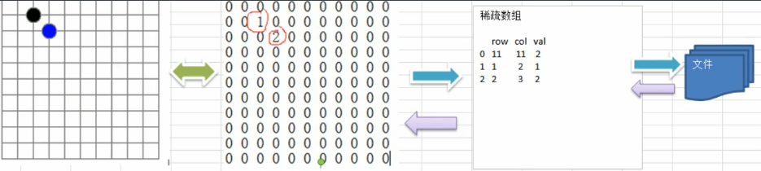

## 二维数组转稀疏数组的思路
1. 遍历原始的二维数组，得到有效数据的个数sum
2. 根据sum就可以创建稀疏数组`sparseArr int[sum+1][3]`
3. 将二维数组的有效数据数据存入到稀疏数组
## 稀疏数组转原始的二维数组的思路

1. 先读取稀疏数组的第一行， 根据第-行的数据，创建原始的维数组,比如上面的`chessrr2= i[11][11]`
2. 在读取稀疏数组后几行的数据，并赋给原始的二维数组即可.

