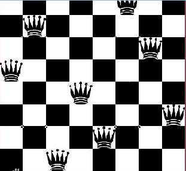
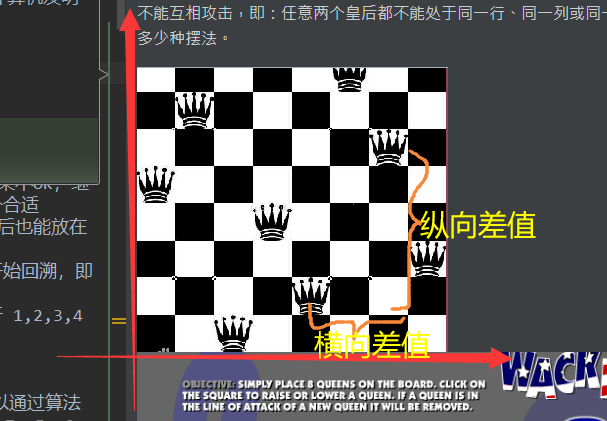

## 八皇后问题
八皇后问题，是一个古老而著名的问题，是回溯算法的典型案例。该问题是国际西洋棋棋手马克斯·贝瑟尔于1848年提出：在8×8格的国际象棋上摆放八个皇后，使其不能互相攻击，即：任意两个皇后都不能处于同一行、同一列或同一斜线上，问有多少种摆法。




### 八皇后问题算法思路分析

1. 第一个皇后先放第一行第一列
1. 第二个皇后放在第二行第一列、然后判断是否OK， 如果不OK，继续放在第二列、第三列、依次把所有列都放完，找到一个合适
1. 继续第三个皇后，还是第一列、第二列……直到第8个皇后也能放在一个不冲突的位置，算是找到了一个正确解
1. 当得到一个正确解时，在栈回退到上一个栈时，就会开始回溯，即将第一个皇后，放到第一列的所有正确解，全部得到.
1. 然后回头继续第一个皇后放第二列，后面继续循环执行 1,2,3,4的步骤 【示意图】

### 说明
理论上应该创建一个二维数组来表示棋盘，但是实际上可以通过算法，用一个一维数组即可解决问题. `arr[8] = {0 , 4, 7, 5, 2, 6, 1, 3}` //对应arr 下标 表示第几行，即第几个皇后，`arr[i] = val , val` 表示第`i+1`个皇后，放在第`i+1`行的第`val+1`列


## 使用到回溯算法

高斯认为有76种方案。1854年在柏林的象棋杂志上不同的作者发表了40种不同的解，后来有人用图论的方法解出92种结果。计算机发明后，有多种计算机语言可以解决此问题


```java
package com.atguigu.recursion;

public class Queen8 {

    // 一共有多少个皇后（此时设置为8皇后在8X8棋盘）
    int max = 8;
    // 该数组保存结果，第一个皇后摆在array[0]列，第二个摆在array[1]列
    int[] array = new int[max];
    static int count = 0;

    public static void main(String[] args) {

        Queen8 queen8 = new Queen8();
        queen8.check(0);
        System.out.println("一共有" + count + "种解法");
    }

    /**
     * n代表当前是第几个皇后 [n 是从 0 开始算的，即0 表示第一个皇后, 同时n也表示第几行]
     * 即 第1行是第一个皇后(n=0)，第2行是第二个皇后(n=1), 第8行是第8个皇后(n=7)，如果遍历到第9行(n=8)，说明
     * 皇后全部放置好了, 就相应的得到了一种解法...
     * 然后回溯 ，又将第一个皇后，放置第1行的第2列...
     *
     * @param n 皇后n在array[n]列
     */
    private void check(int n) {
        //终止条件是最后一行已经摆完，
        //由于每摆一步都会校验是否有冲突，
        //所以只要最后一行摆完，说明已经得到了一个正确解
        if (n == max) {
            print();
            return;
        }
        //将第n个皇后从.第一列开始放值，然后判断是否和本行本列本斜线有冲突，如果OK，就进入下一行的逻辑
        for (int i = 0; i < max; i++) {
            array[n] = i; //先将第一个皇后放置第一行的第一列 array[0] = 0
            if (judge(n)) {  // 如果 该皇后没有和其它皇后冲突
                check(n + 1); // 放第二个皇后，因为是递归，因此大家可以思考，第二个皇后是从 第二行的第1列开始放
            }
        }
    }

    /**
     * 查看n皇后是否满足约束条件(即：检查皇后n是否会发生冲突)
     * 如果冲突，返回 false , 如果不冲突返回true
     * 0 4 7 5 2 6 1 3
     *
     * @param n
     * @return
     */
    private boolean judge(int n) {
        for (int i = 0; i < n; i++) {
            //说明: 
            //1. array[i] == array[n] 判断 是不是在同一列
            //2. Math.abs(n - i) == Math.abs(array[n] - array[i]) 判断是不是在同一条斜线
            //3. 不用判断是不是在同一行，因为我们每放一个皇后，行是递增的.
            if (array[i] == array[n] || Math.abs(n - i) == Math.abs(array[n] - array[i])) {
                return false;
            }
        }
        return true;
    }
 
    /**
     * 打印这个满足条件的八皇后的放置位置
     */
    private void print() {
        count++;
        for (int i = 0; i < array.length; i++) {
            System.out.print(array[i] + " ");
        }
        System.out.println();
    }
}

```

> 判断斜线的时候,直接用 横坐标减去纵坐标,若,两个位置的差值相等,
>
>就是同一个斜线上的
>
>然而,这个上面例子中,存放的方式是:
>
>一维数组: 数组的下标代表棋盘的行号,数组的值代表棋盘的列号
>
>数组中员孙的个数即为 皇后的 棋子
>
>在记性斜线判断的时候,计算的是,两点的横向差值和纵向差值是否相等,若相等,则,斜率为1,即tan45° 嗯, 就判断出了是在一个斜线上,皇后能够互相攻击,嗯,哦可,秒啊
>




 