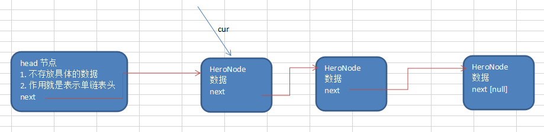

# 单链表的常见面试题有如下:
- 求单链表中有效节点的个数
- 查找单链表中的倒数第k个结点 【新浪面试题】
- 单链表的反转【腾讯面试题，有点难度】
- 从尾到头打印单链表 【百度，要求方式1：反向遍历 。 方式2：Stack栈】
- 合并两个有序的单链表，合并之后的链表依然有序【课后练习.】

>直接看老师代码演示。


```java
	//方法：获取到单链表的节点的个数(如果是带头结点的链表，需求不统计头节点)
	/**
	 *
	 * @param head 链表的头节点
	 * @return 返回的就是有效节点的个数
	 */
	public static int getLength(HeroNode head) {
		if(head.next == null) { //空链表
			return 0;
		}
		int length = 0;
		//定义一个辅助的变量, 这里我们没有统计头节点
		HeroNode cur = head.next;
		while(cur != null) {
			length++;
			cur = cur.next; //遍历
		}
		return length;
	}
```




```java

	//查找单链表中的倒数第k个结点 【新浪面试题】
	//思路
	//1. 编写一个方法，接收head节点，同时接收一个index
	//2. index 表示是倒数第index个节点
    // 音为我们这个是单链表,不可能从后面往前走
	//3. 先把链表从头到尾遍历，得到链表的总的长度 getLength
	//4. 得到size 后，我们从链表的第一个开始遍历 (size-index)个，就可以得到
	//5. 如果找到了，则返回该节点，否则返回nulll
	public static HeroNode findLastIndexNode(HeroNode head, int index) {
		//判断如果链表为空，返回null
		if(head.next == null) {
			return null;//没有找到
		}
		//第一个遍历得到链表的长度(节点个数)
		int size = getLength(head);
		//第二次遍历  size-index 位置，就是我们倒数的第K个节点
		//先做一个index的校验
		if(index <=0 || index > size) {
			return null;
		}
		//定义给辅助变量， for 循环定位到倒数的index
		HeroNode cur = head.next; //3 // 3 - 1 = 2
		for(int i =0; i< size - index; i++) {
			cur = cur.next;
		}
		return cur;

	}

```


