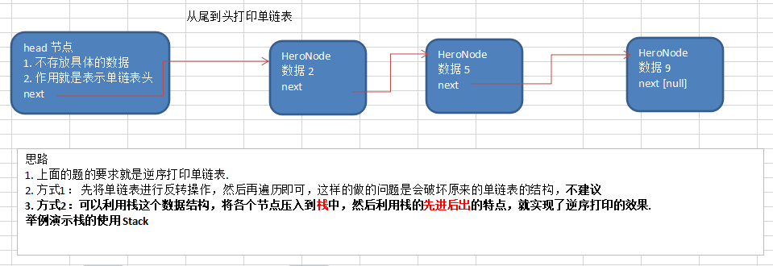

```java
package com.atguigu.linkedlist;

import java.util.Stack;

/**
 * ClassName:  <br/>
 * Description:  <br/>
 * Date: 2021-02-19 14:17 <br/>
 * @project data_algorithm
 * @package com.atguigu.linkedlist
 */
public class TestStack {


	public static void main(String[] args) {
		Stack<String> stack = new Stack();
		// 入栈
		stack.add("jack");
		stack.add("tom");
		stack.add("smith");

		// 出栈
		// smith, tom , jack
		while (stack.size() > 0) {
			System.out.println(stack.pop());//pop就是将栈顶的数据取出
		}
	}

}


```

输出

```cmd
smith
tom
jack

Process finished with exit code 0
```

>栈就是一个量筒,先入后出


```java

	//方式2：
	//可以利用栈这个数据结构，将各个节点压入到栈中，然后利用栈的先进后出的特点，就实现了逆序打印的效果
	public static void reversePrint(HeroNode head) {
		if(head.next == null) {
			return;//空链表，不能打印
		}
		//创建要给一个栈，将各个节点压入栈
		Stack<HeroNode> stack = new Stack<HeroNode>();
		HeroNode cur = head.next;
		//将链表的所有节点压入栈
		while(cur != null) {
			stack.push(cur);
			cur = cur.next; //cur后移，这样就可以压入下一个节点
		}
		//将栈中的节点进行打印,pop 出栈
		while (stack.size() > 0) {
			System.out.println(stack.pop()); //stack的特点是先进后出
		}
	}

```


