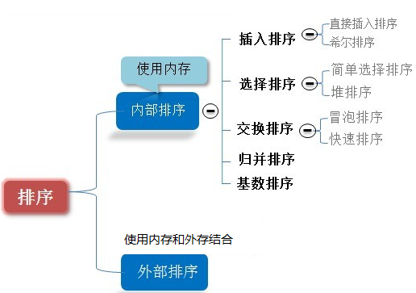

# 排序算法的介绍

排序也成排序算法

排序也称排序算法(`Sort Algorithm`)，排序是将**一组数据**，依**指定的顺序**进行排列的过程。
排序的分类：
1) 内部排序:
指将需要处理的所有数据都加载到**内部存储器(内存)**中进行排序。
2) 外部排序法：
**数据量过大**，无法全部加载到内存中，需要借助外部存储进行
排序。
3) 常见的排序算法分类(见右图):

> 排序的分类,这个地方,就敲黑板了

## 算法的时间复杂度

度量一个程序(算法)执行时间的两种方法

1. 事后统计的方法

   这种方法可行, 但是有两个问题：

   1. 一是要想对设计的算法的运行性能进行评测，需要实际运行该程序；
   2. 二是所得时间的统计量依赖于计算机的硬件、软件等环境因素, **这种方式，要在同一台计算机的相同状态下运行，才能比较那个算法速度更快。**

2. 事前估算的方法

   1. 通过分析某个算法的时间复杂度来判断哪个算法更优.

   

 